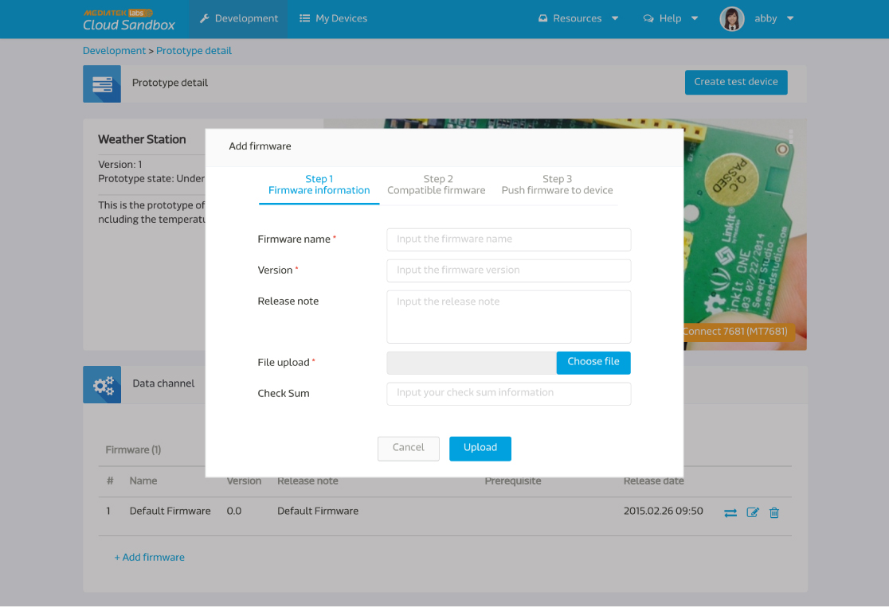

# 管理固件

您可以使用 MediaTek Clous Sandbox (MCS) 来管理您的固件，并且透过空中更新将固件更新至您的装置。

您可以在产品原型页面中的**固件分页**来使用我们的固件服务。

点击**新增固件**来上传一个新的固件吧。

请输入固件名称，版本，并且选择您要上传的固件档案，然后点击上传按钮。

之后，选择能相容此固件更新的前置韧体。

当您在选择能和此固件更新相容的前置固件时，您会发现，系统的预设值是所有的固件都会被选取。您可以更改此设定，只要勾选您想要能相容的固件即可。只有您在此勾选的前置固件，能够和您所上传的新固件相容。

如果您暂时不想将您所上传的固件更新直接更新置装置，您可以点击完成按钮退出，或是您可以点击下一步按钮来选择您要更新此固件的装置。

当您选取好要更新此固件的装置后，点击推拨按钮。您亦可以在固件分页中，点击某一固件的清单中右边第一个图标来做固件推播。

您亦可以于装置详情页面中来做固件更新服务。您只需要再装置详情页面中，点击固件分页，您将会看到此装置当时所使用的固件，和您和此装置目前固件相容的其他固件更新。

点击您欲更新的固件后方的**升级**按钮来更新。

