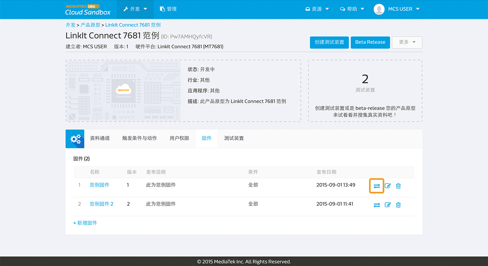

# 管理固件

您可以使用 MediaTek Clous Sandbox (MCS) 来管理您的固件，并且透过空中更新将固件更新至您的装置。


MCS 提供产品原型及其测试装置的固件库存服务。 MCS 提供基本的固件版本控制和上传和下载服务。使用者可以选择在网页上直接推播固件资讯至装置或是使用MCS APIs 来让装置主动取得固件资讯。

MCS 将不会处理装置端的固件更新，使用者需自行开发您的开发板来呼叫固件相关APIs 来下载和更新固件。

##上传固件

您可以在**产品原型**页面中的**固件**分页来使用我们的固件服务。点击**新增固件**来上传一个新的固件吧。


请输入固件名称，版本，并且选择您要上传的固件档案，然后点击上传按钮。


之后，选择能相容此固件的前版固件。系统的预设值是所有固件，您可以透过选择**特定的固件**并勾选能与此上传版本相容的固件修改其相容设定。只有正使用您所勾选的前版固件的装置，才能够透过 MCS 网页或 API 获取此次上传的固件资讯，进行升级。

如果您不想立即将此新版固件直接推送至连线中的装置触发更新，您可以点击完成按钮退出，或是您可以点击下一步按钮来选择您要推送更新的装置。


当您选取好欲推送固件的装置后，点击推拨按钮。


您亦可以在固件分页中，点击某一固件的清单中右边第一个图标开启固件推送页面。



## 更新固件

将固件上传至 MCS 主控台后，您可以透过 MCS 主控台页面**推送**固件资讯至连线中的装置，或是透过 **MCS APIs** 取得与此装置相容的固件资讯。

若要在 MCS 主控台使用**固件推送**功能，您可以在**产品原型 -> 固件**分页下点击推送图示并选取您所要推送至的装置，或于单一装置的**装置详情 -> 固件**分页下，选取欲推送的固件并点击推送按钮。

请注意，**推送**按钮只有在此装置有与 MCS 平台保持连线时才可以被点击。您可以透过装置名称前方的灯号来判断此装置是否在线。当灯号为绿色时，表示装置在线；当灯号为灰色时，表示装置离线。


推送完成后,您将会看到固件推送成功讯息。


请注意, MCS 平台只负责将固件更新资讯传递到装置端，并不会处理装置端的固件更新程序。您必须自行开发您的装置，完成后续固件的下载与更新。

当您按下推送按钮后，MCS 平台会将固件资讯透过装置与 MCS 平台连线的协定回传给装置，其格式如下：

1. TCP 连线：**deviceId,deviceKey,timestamp,FOTA,version,MD5,URL**，例如
	
	```
	Dbxxxx9k,TPJVxxxxxxxxBxBv,1513132150790,FOTA,2.0,null,https://cdn.mediatek.com/firmwares/P9MxxxxxxbTK/6a94dxxxxxxxxxxxxxxxxxxxx61f5df/a.bin
	```
2. MQTT 连线：**timestamp,FOTA,version,MD5,URL**，例如

	```
	1513133357160,FOTA,2.0,null,https://cdn.mediatek.com/firmwares/P9MxxxxxxbTK/6a94dxxxxxxxxxxxxxxxxxxxx61f5df/a.bin	```

栏位介绍：

* deviceId: 装置的 deviceId（由于 MQTT 连线时，必须先指定 device ID，因此回传內文不包含此资讯）
* deviceKey: 装置的 deviceKey（由于 MQTT 连线时，必须先指定 device key，因此回传內文不包含此资讯）
* timestamp: 按下推送按钮的时间
* FOTA: 固定字串，表示固件更新
* version: 固件版本
* MD5: 固件 MD5 杂凑，可用于检查下载后的档案是否完整。
* URL: 固件的下载网址

若您是使用 LinkIt Connect 7681 开发板，您将不必额外对开发板进行开发，我们已经内建固件更新功能。您唯一需要注意的是确认固件版本号有被正确设置，版本号需要为独特不能重复的。此外，7681 装置由于硬体限制，只能接受版本号高于现有版本的固件更新。


## 使用 MCS APIs

MCS 提供有以下几个与固件相关的 APIs ，方便您开发和管理装置与固件。

1. [回报装置固件 API](https://mcs.mediatek.com/resources/zh-CN/latest/api_references/#回报装置固件版本)：将装置目前使用之固件版本回报至 MCS 平台。请注意，您回报的固件版本必须是已上传至 MCS 平台的固件版本。
2. [取得可用固件 API](https://mcs.mediatek.com/resources/zh-CN/latest/api_references/#取得与此装置相容的固件列表)：若您已将装置的固件版本回报至 MCS 平台，您可以使用此 API 获取相容的固件资讯，包含固件的下载网址。若您未曾回报装置的固件版本，其回传的固件资讯为无版本相容性限制的所有固件资讯。

3. [Retrieve the compatible firmwares by version](https://mcs.mediatek.com/resources/zh-CN/latest/api_references/#取得与特定版本相容的固件列表)：此 API 提供了一个更为弹性的方法取得与特定版本相容的固件列表。您只需在 API 请求中指定要比较的版本号码即可。

4. [Retrieve firmware URL](https://mcs.mediatek.com/resources/zh-CN/latest/api_references/#取得固件下载网址)：此 API 会回传指定固件的下载网址。


