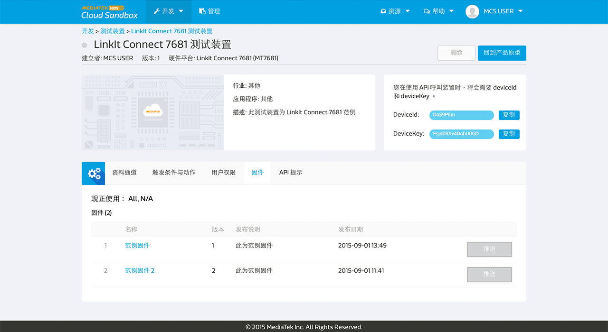

# 管理固件

您可以使用 MediaTek Clous Sandbox (MCS) 来管理您的固件，并且透过空中更新将固件更新至您的装置。

MCS 提供产品原型及其测试装置的固件库存服务。 MCS 提供基本的固件版本控制和上传和下载服务。使用者可以选择在网页上直接推播固件资讯至装置或是使用MCS APIs 来让装置主动取得固件资讯。

MCS 将不会处理装置端的固件更新，使用者需自行开发您的开发板来呼叫固件相关APIs 来下载和更新固件。

##上传固件至产品原型

您可以在产品原型页面中的**固件分页**来使用我们的固件服务。

点击**新增固件**来上传一个新的固件吧。

请输入固件名称，版本，并且选择您要上传的固件档案，然后点击上传按钮。

之后，选择能相容此固件更新的前置韧体。

当您在选择能和此固件更新相容的前置固件时，您会发现，系统的预设值是所有的固件都会被选取。您可以更改此设定，只要勾选您想要能相容的固件即可。只有您在此勾选的前置固件，能够和您所上传的新固件相容。

如果您暂时不想将您所上传的固件更新直接更新置装置，您可以点击完成按钮退出，或是您可以点击下一步按钮来选择您要更新此固件的装置。

当您选取好要更新此固件的装置后，点击推拨按钮。您亦可以在固件分页中，点击某一固件的清单中右边第一个图标来做固件推播。

## 替您的装置更新固件

您亦可以于装置详情页面中来做固件更新服务。您只需要在装置详情页面中，点击固件分页，您将会看到此装置当时所使用的固件，和您和此装置目前固件相容的其他固件更新。

请注意，**推播**按钮只有在此装置有与 MCS 平台保持连线时才可以被点击。您可以使用装置名称前方的灯号来判断此装置是否在线。当灯号为绿色时，表示装置在线;当灯号为灰色时，表示装置离线。

点击您欲更新的固件后方的**推播**按钮来更新。之后，您将会看到固件推送成功讯息。

请注意，MCS 平台只会将固件更新资讯传递到装置端，我们将不会处理装置端的固件更新程序。您必须自行开发您的装置，以下载和更新固件。

当您按下推播按钮后，MCS command server 会将资讯以以下格式传递给装置：

**deviceId, deviceKey, timestamp, FOTA, version, MD5, URL**

* deviceId：装置的 deviceId
* deviceKey：装置的 deviceKey
* timestamp：按下推播按钮的时间点
* FOTA：字串
* version：被传递的固件版本
* MD5：被传递的固件 MD5
* URL：被传递的固件的下载网址

若您的装置是透过 MQTT 和 MCS 做相连，当您按下推播按钮后，MCS MQTT Broker 会将资讯以以下格式传替给装置：

**timestamp, FOTA, version, MD5, URL**

* timestamp: 按下推播按钮的时间点
* FOTA: 字串
* version: 被传递的韧体版本
* MD5: 被传递的韧体 MD5
* URL: 被传递的韧体的下载网址

此外，若您是使用 7681 开发板，您将不必额外对开发板进行开发，我们已经内建固件新功能。您唯一需要注意的是确认固件版本号有被正确设置，版本号需要为独特不能重复的。此外，7681 裝置由於硬體限制，只能接受版本号高于现有版本的固件更新。

##使用 MCS 的 API 来回报和更新固件至 MCS 平台

MCS 提供多种固件相关的的 API 来让您回报装置目前使用之固件，取得装置所有可使用固件，和取得欲更新知固件下载网址等等。唯一需要注意的是，您必须自行在您的装置上开发以呼叫使用这些 API。

您可以使用**回报装置固件** [API](https://mcs.mediatek.com/resources/zh-TW/latest/api_references/) 来和MCS平台回报您目前使用的固件版本。当装置回报固件版本后，您将可以在MCS平台中的固件分页中查看到此资讯。

若您不想透过 MCS 平台来查看或是更新固件，您可以使用**取得装置所有固件资讯** [API](https://mcs.mediatek.com/resources/zh-TW/latest/api_references/) 以取得所有装置可使用的固件清单。

当您取得所有装置可使用的固件清单，并决定您要将装置更新至特定固件后，您可以使用**取得固件网址** [API](https://mcs.mediatek.com/resources/zh-TW/latest/api_references/) 来取得您欲更新的固件位置资讯。

