# 触发条件与动作

您可以设定触发条件和动作，当特定资料通道回传的值符合您所设定的条件，系统将会发出通知提醒。 

以下是支援设定触发条件的**资料通道**：

1. 开关
2. 分类
3. 字串
4. 十六进位值
5. 整数
6. 浮点数

并可套用以下的**条件**：

1. 大于
2. 小于
3. 等于
4. 介于～之间
5. 数值异动

当资料通道上传的数值符合设定条件时时，会触发通知动作。以下是四种支援的通知**动作**：

1. 电子邮件

	有权限能访问这个装置的使用者，皆能收到电子邮件通知，包括装置的拥有者、管理者与一般检视。
	
2. 手机推播

	您必须先安装 MediaTek Cloud Sandbox 手机应用程式，并且登入 MCS 帐号。	

3. Webhook

	MCS 会发送一个 HTTP 请求到您指定的网址（Callback URL）。
		
4. 网页警报
	
	当触发条件成立时，在 MCS 网页上会显示相关的提醒，包含触发警报的严重等级。
	

## 设定触发条件与动作

您可以在**产品原型**页面下设定**触发条件与动作**，此触发规则会套用在此原型下的所有装置。随后，您可以在各个**装置**底下，修改条件的**触发数值**。

操作步骤如下：

1. 当您点入产品原型页面后，点选**触发条件和动作**分页 -> 点击**新增触发条件和动作**。

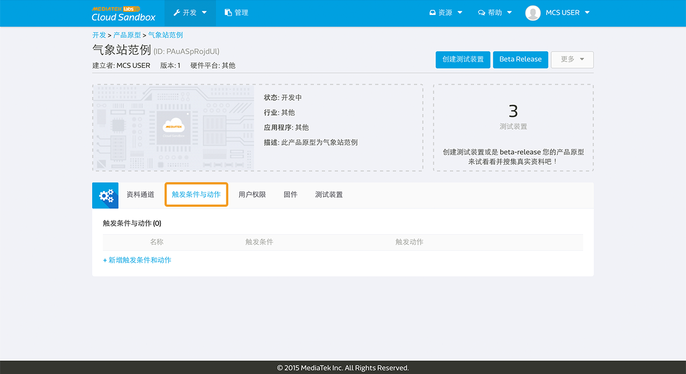

2. 在**新增触发条件和动作**视窗中，填入必要的资讯。

	步骤一：**触发条件名称**之后将会显示于**网页警报**的讯息中。
	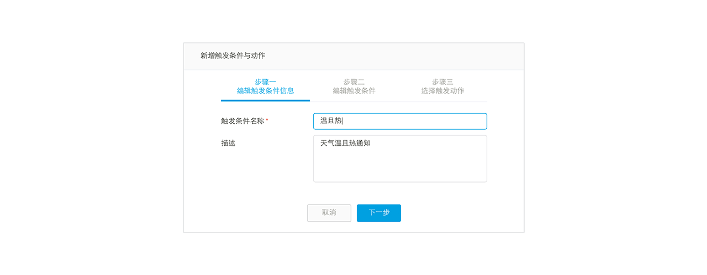
	
	步骤二：您可设定多个比对条件，当这些**条件同时成立**时（**AND 逻辑**），则会触发通知。请注意，要让条件同时成立，您必须将此条件有用到的资料通道数值**同时上传**到 MCS，意即写在同个 HTTP 上传的请求当中。
	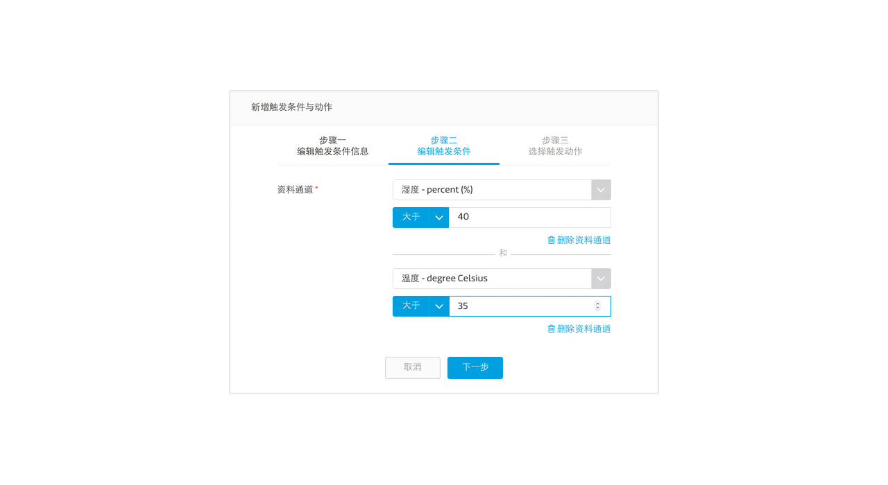
	
	步骤三：至少选择一个**触发动作**，当条件成立时，发送通知。本章后面会针对触发动作有更详细的介绍。
	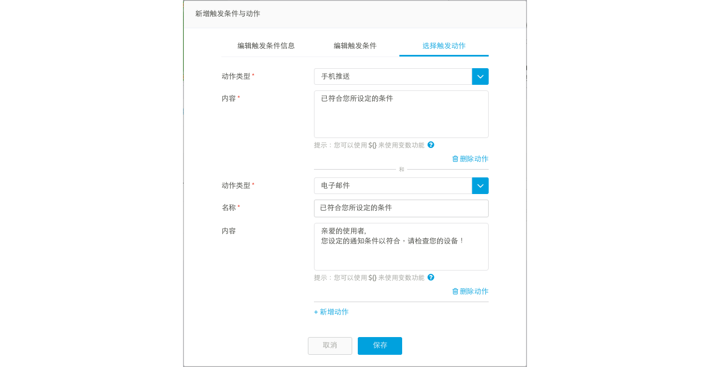

您在产品原型中设定的触发条件和动作，会被产品原型下所有的测试装置所继承。在测试装置中，您只能更改触发条件的值或是选择打开或是关闭此触发条件和动作。
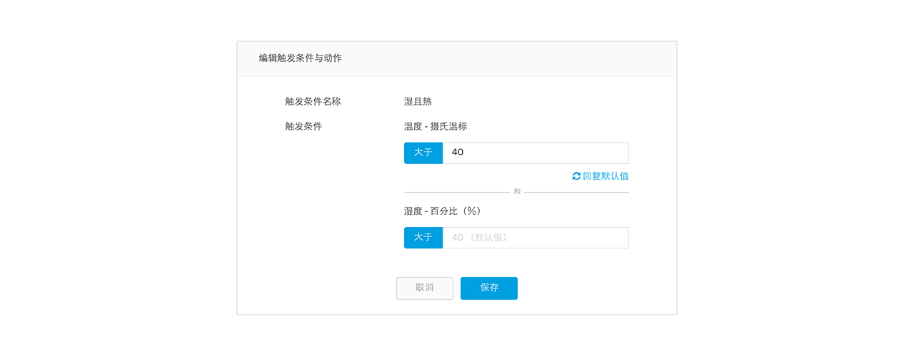

请注意，只有透过装置上传的资料点（上传资料点时，在 HTTP 表头带有 **deviceKey** 或是透过 **MQTT** 协定发布资料）才会触发动作。使用者透过 MCS 网页操作资料通道而产生的资料点将不会触发。

## 触发动作详细介绍
### 设定手机推播

若使用者有多个手机装置，MCS 能够提供使用者设定是否每只手机装置都要收到手机推播通知。使用者能于两个地方设定：

1. 在**个人档案**页面中，设定是否手机要收到**全部**来自 MCS 的推播通知。
2. 在**测试装置**页面中，设定是否手机要收到来自**特定测试装置**的推播通知。

在**个人档案**页面中，您可以看到所有您有安装 MCS 手机应用程式的手机列表。您可在此设定是否每只手机要收到或不收到**全部**来自 MCS 的推播通知。

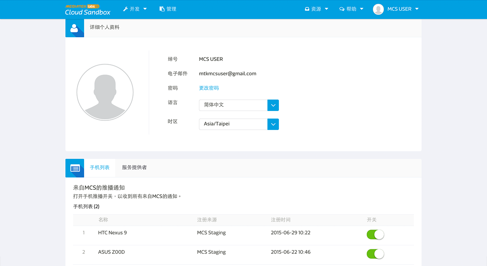

在**测试装置**页面中，展开**管理您的触发动作**，您可以看到所有您有安装 MCS 手机应用程式的手机列表。您可在此设定是否特定手机要收到或不收到**特定测试装置**的推播通知。

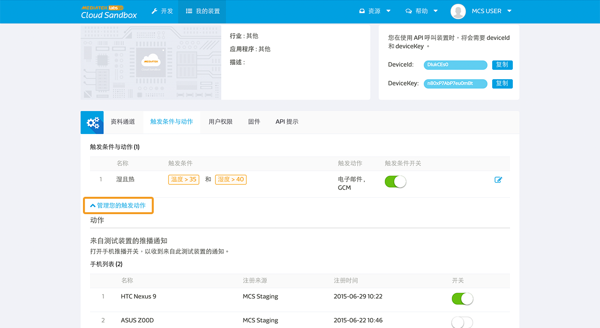

### 设置 Webhook 

触发动作中的 webhook，让您可以自行组合一个 HTTP 的请求，并在触发条件成立后发送到指定的服务器。

要使用此功能，您只需要在设定触发条件时，选择**webhook** 作为触发动作，并且指定服务器**网址**、**请求方法**、**HTTP 标头**与**请求内文**。此外，您也可以在网址、标头的值以及请求内文中使用系统预设的变数。（详细用法请参考后面章节）

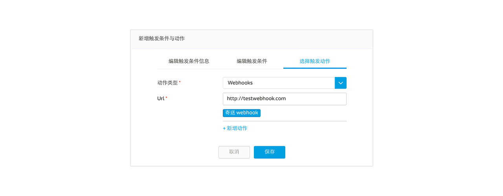

当您选择 webhook 触发动作后，您可以使用测试按钮，来测试此 HTTP 请求是否有正确的被送出。

### 设定网页警报

当您在触发条件与动作中设定网页警报时，也必须指定此警报的严重性等级。

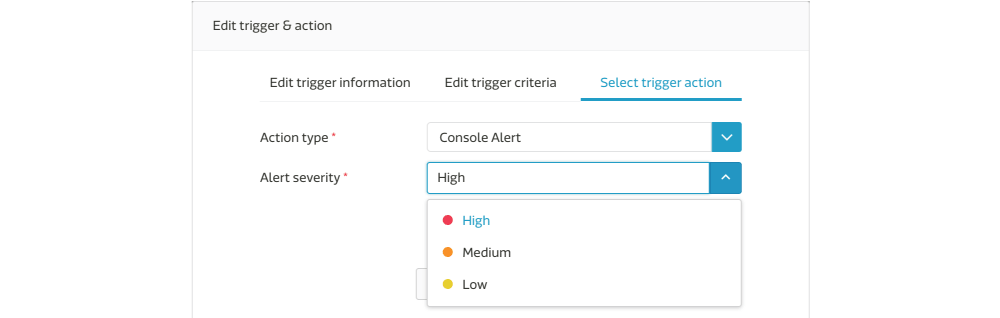

当触发条件成立，网页警报讯息会立即出现在网页上，并显示**严重性等级**等资讯。网页警报会出现在以下三个页面：

1. 资料通道卡片 

	当资料通道的数值符合触发条件，该资料通道上便会出现网页警告标签。展开后可看到更详细的触发资讯，包括**触发条件名称**与**警告发生时间**。在此范例中，此资料点是于 "2018-07-19 11:36" 上传并触发一个名叫 "Water is too hot" 的触发条件。
	
	当你点击**解除**之后，这个警告则会被解除不会显示在网页上，直到下次您的装置在上传符合此触发条件的资料点。

	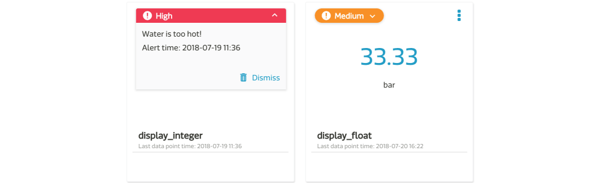

2. 测试装置列表

	在测试装置列表中，**严重性最高**的警报会显示在测试装置的卡片上。
	
	以上面的范例来说，当测试装置底下有两个资料通道皆触发了网页警报，一个严重等级为 "High" 另一个为 "Medium"，则装置卡片上的警报等级，会显示 "High"。当 "High" 的警报解除后（可能是您按下了“解除”按钮，或是重新上传一个不符合触发条件的资料点），则会显示下一等级的警报 "Medium"。
	
	
	
3. 场景图
	
	场景图中，警报标签的呈现方式与测试装置列表ㄧ样。

	

## 在通知内容中使用变数
MCS 预先定义了多个变数让您可以在通知的名称与内容栏位中使用，这些变数代表的是动作被触发时，当下的真实数据。目前支援的变数包含有：

* **${deviceId}**: 设备的 ID
* **${deviceName}**: 设备的名称
* **${value}**: 资料通道的数值

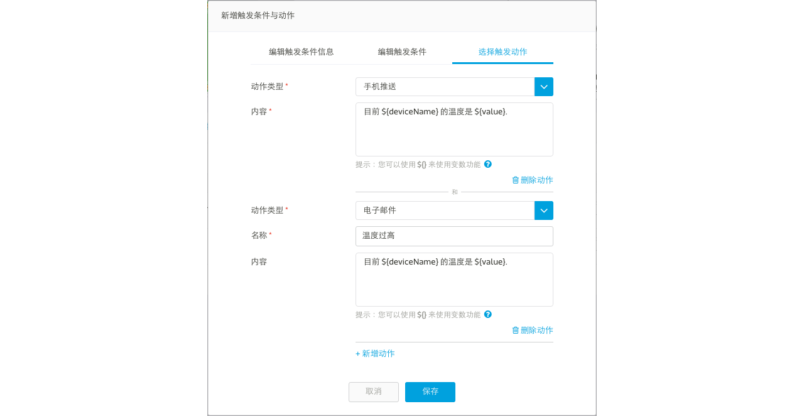

例如

您可将 Email 的内容设定成

	目前 ${deviceName} 的温度是 ${value}.

当通知寄发给使用者时，其中的变数会被置换成当前的真实数据，像是

	目前 我的客厅 的温度是 30.

