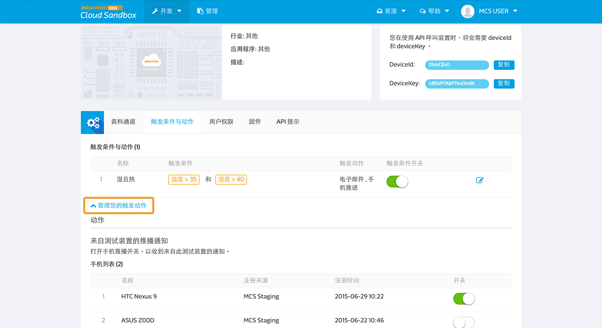
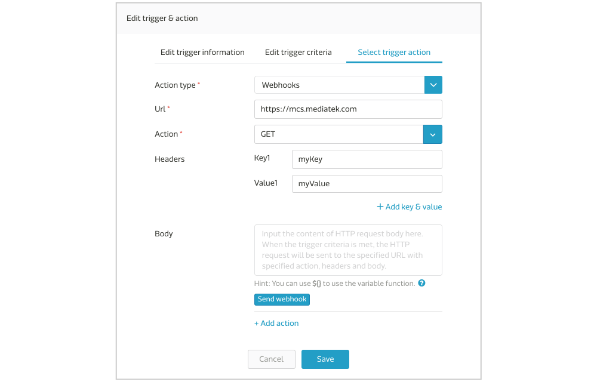

# 设定触发条件和动作

##如何新增触发条件和动作

您可以设定触发条件和动作，当特定资料通道回传的值超过您所设定的范围时，系统将会发出电子邮件或是手机推送通知。您可以自行选择要收到电子邮件或是手机推送通知。此外，MCS 也支援 webhook 触发，您可以输入欲收到处发通知之 URL。

请注意，目前 MCS 的通知只限定使用整数或是浮点数类型的资料型态。并且，只有透过装置上传的资料点（上传资料点时带有 deviceKey）会触发动作。使用者透过 MCS 网页上传之资料点（不带有 deviceKey）将不会触发。

当您点入产品原型页面后，点选**触发条件和动作分页**。

点击**新增触发条件和动作**来新增一个触发条件和动作, 输入您的触发条件名称和描述。

点击下一步来设定触发条件。选择您要设定触发条件的资料通道并且给予触发条件值。触发条件包含大于，小于，等于，和特定范围之间。

您可以在同一个通知条件中，设定多个资料通道。此时，多个资料通道条件都要符合(且逻辑)，系统才会发出通知。若您想要单一条件符合(或逻辑)就收到通知，您就须设定多个通知条件。

点击下一步来设定触发动作。您可以选择使用电子邮件或是手机推送通知。通知将会被发送给每个有此装置权限的使用者。

您在产品原型中设定的触发条件和动作，会被产品原型下所有的测试装置所继承。在测试装置中，您只能更改触发条件的值或是选择打开或是关闭此触发条件和动作。

##替不同手机设定触发条件和动作

若使用者有多个手机装置， MCS能夠提供使用者設定是否每隻手機裝置都要收到手機推播通知。使用者能於兩個地方設定：

1. 在**个人档案**页面中，设定是否手机要收到全部来自 MCS 的推播通知。
2. 在**测试装置**页面中，设定是否手机要收到来自特定测试装置的推播通知。

在**个人档案**页面中，您可以看到所有您有安装 MCS 手機應用程式的手機列表。您可在此設定是否特定手機要收到或不收到**全部**來自 MCS 的推播通知。

在**測試裝置**頁面中，展開**管理您的觸發動作**，您可以看到所有您有安裝 MCS 手機應用程式的手機列表。您可在此設定是否特定手機要收到或不收到特定測試裝置的推播通知。

# 设定一个 webhook 触发动作

若要设定一个 webhook 触发动作，您首先需要在产品原型页面中的触发条件与动作分页中，新增一个 webhook 之触发条件与动作。并且输入您欲收到此触发通知之网址。

当您选择 webhook 触发动作后，您可以使用测试按钮，来测试是否通知有被送出。送出之资讯包含装置名称, deviceId, deviceKey, 和触发值。
