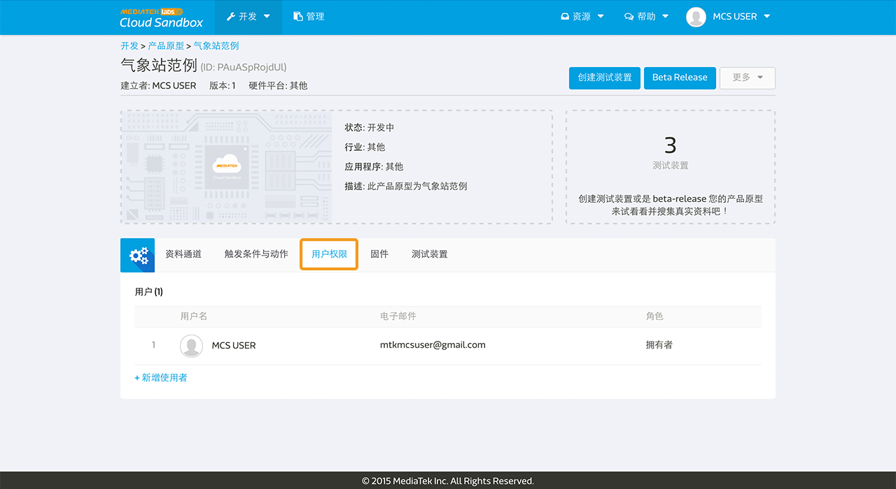
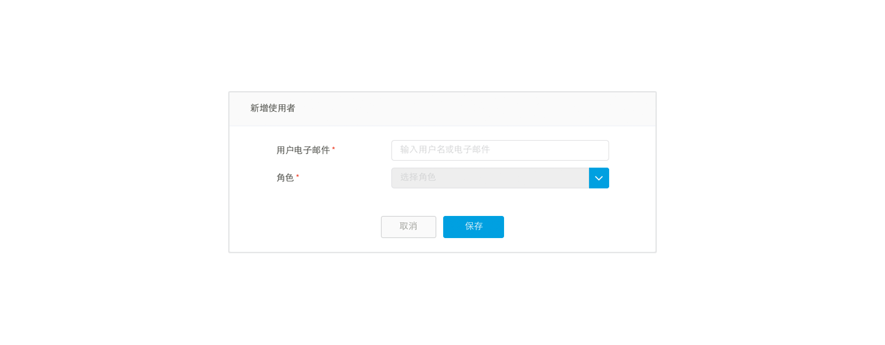

# 设定使用者权限

在 MediaTek Cloud Sandbox (MCS) 平台上，您可以为您的产品原型或是装置设定不同的使用者权限。您可以在产品原型或是装置详细资料页面中的使用者权限分页中做权限设定。

MCS　提供了三种使用者权限：

1. **拥有者权限**, 拥有新增，更新，检视，删除特定产品原型，測試裝置，以及裝置的權限。
2. **管理员权限**, 拥有新增，更新，检视特定产品原型或是测试装置的权限。
3. **观看者权限**, 只拥有检视特定产品原型或是测试装置的权限。

## 产品原型与测试装置

如果您的身分权限是拥有者或是管理员，您可以为特定产品原型或是测试装置增加或是删除使用者权限。

在产品原型详细资料或装置详细资料页面中，点选使用者权限分页，点击新增使用者。

输入使用者电子邮件地址来搜寻 MCS 使用者，并选择管理员或是浏览者权限。之后点击储存按钮。

请注意，测试装置并不会从他所属的产品原型中继承使用者权限。只有在产品原型的拥有者或是管理员有权限建立测试装置，并且建立此测试装置的使用者，将成为此测试装置的拥有者。此测试装置的拥有者，能替此测试装置新增其他使用者权限。

## Beta-release 与管理

MCS 锁定只有**产品原型拥有者**权限者，可以beta-release 该产品原型。 Beta-release 之后，也将只有产品原型的拥有者，可以建立带有序号的装置，并且于管理页面查看并管理这些装置。

产品原型管理员和观看者，并无权限可以beta-release 该产品原型；也无权限可以建立带有序号之装置。但是产品原型管理员，依然保有在该产品原型建立测试装置之权限。
