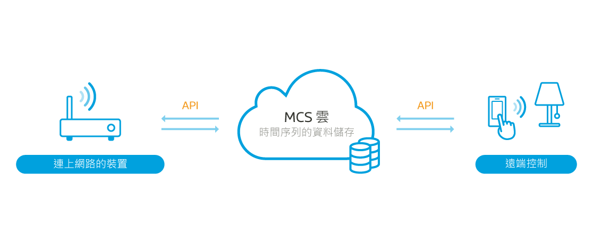
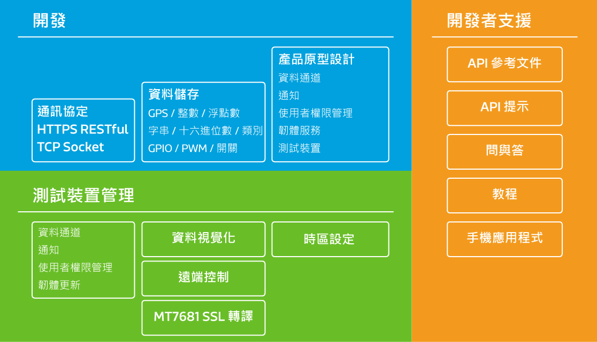

# **MediaTek Cloud Sandbox 介紹**

MediaTek Cloud Sandbox (MCS) 提供您打造準備商業化的穿戴式和物聯網裝置，所需要的數據和裝置管理服務。它支持您專心的開發產品原型，不必煩惱建立一套自己的雲端基礎設施。

您可以在我們提供的強大的網頁儀表板介面上，看到使用我們提供的 RESTful API 從裝置蒐集回來的圖形化的資料。之後，您可以通過從儀表板發出命令控制您的穿戴式和物聯網裝置。此外，我們提供附屬的手機應用程式讓您能查看蒐集到的數據，並從任何地方控制您的裝置。

以下是您可以透過 MediaTek Cloud Sandbox 做的事情:

•	定義專屬於您的穿戴式和物聯網產品原型以及個人化裝置。

•	隨時在裝置和 MCS 平台間推播各式數據點，例如 GPS 資料點、溫度、或是濕度。

•	遠端控制您的裝置。

•	圖形化的資料點介面。

•	當資料點超過特定觸發條件預設範圍時，執行動作。

•	管理所有的裝置。

•	使用附屬的手機應用程式遠端控制裝置。

•	建立產品原型，裝置，和蒐集來的資料報表。

•	空中（Over the air）韌體更新。

•	使用者權限管理。

為了讓您更通行無阻的使用 MCS，我們提供了 API 使用說明文件、問與答和一系列的教程讓您能夠快速上手我們所提供的功能和服務。

## **事前準備**
要使用 MediaTek Cloud Sandbox，您必須先：
1. [註冊成為 MediaTek Labs 使用者] (http://labs.mediatek.com/dpRegister/create)
2. [登入 MediaTek Cloud Sandbox] (http://mcs.mediatek.com/v2console)
3. 取得裝置的 DeviceId (API Key) 來做 API 呼叫使用
