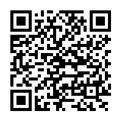

# 問與答

**1. 哪些裝置可以和 MCS 平台相連?**

幾乎任何具有互聯網連接功能的設備都可以連接到 MCS ，裝置須能夠支持 RESTful 或 TCP Socket。

**2.我能在MCS平台上做什麼呢?**

您可以使用 MCS 開發者平台和 RESTful API 來快速開發您的產品原型，並連接裝置來實現您的應用。

**3. 我該如何上手?**

我們提供的詳細步驟和圖示的教程獲協助您快速開發您的第一個產品原型。您亦可點擊畫面右上方資源內的教程。

**4. 我能分享我的產品原型或是裝置給其他使用者嗎?**

您可以在開發或是我的裝置頁面中的使用者權限分頁來設定您要賦予權限的使用者。若使用者只需讀取資料，您可以賦予瀏覽者權限；若使用者需要控制裝置狀態或是變更設定，您則可賦予系統管理者權限。

**5.我能變更資料顯示時區嗎?**

系統目前會偵測您的所在地時區。您亦可點擊畫面又上方的使用者配置頁面來更改您想要顯示的時區。

**6. 我要去哪裡下載手機應用程式呢? **

若您是使用 MCS 全球版本，請點擊此連結[here](https://play.google.com/store/apps/details?id=com.mediatek.iotcloud) 或用此QR code來下載手機應用程式:

若您是使用 MCS 中國版本，請點擊此連結 [here](https://s3.cn-north-1.amazonaws.com.cn/mtk.linkit/mcs-latest-production-release.apk) 直接下載手機應用程式。

目前只支援安卓（Android）手機。

**7. 我已經有了 MediaTek Labs 帳號了，是否能用此帳號登入 MCS 平台呢? **

是的，您可以不須註冊，直接在登入頁面點擊"使用 MediaTek Labs 帳號登入"來登入 MCS 平台。

**8. MCS支援哪些瀏覽器?**

我們建議您可以使用 Chrome, Firefox, 或是 Safari 來瀏覽MCS網站。

**問與答的內容沒有您想要問的問題嗎? 您可以直接寫信和我們聯絡。若您使用 MCS 全球網站，請寄信至 <mtkcloudsandbox@mediatek.com>；若您使用 MCS 中國網站，請寄信至<mcs_cn.mail@mediatek.com>。**
