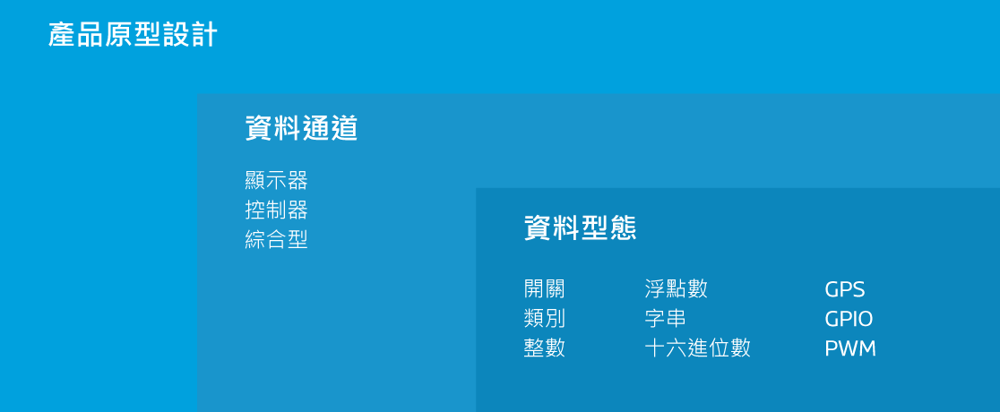

# 核心慨念

在這個章節，我們將介紹有關於 MediaTek Cloud Sandbox  的一些基本概念，幫助您打造您的穿戴式和物聯網裝置。您可以在 MCS 的開發頁面，操作所有關於產品原型的開發的功能和服務。此外，您亦可在 MCS 的**管理**頁面，看到所以您建立的或是有授權使用的裝置。此外，使用者可以在**儀表板**中查看關於他在此平台內的重點資訊，例如快速上手指南、概觀、以及使用率。

# 儀表板

每當使用者登入 MCS 平台時，將會直接被導引至儀表板頁面。在儀表板頁面中，使用者可以查看以下資訊：

* **快速上手指南** 使用者能利用此指南快速熟悉 MCS 平台。
* **概觀** 使用者可以再次查看最新更新的產品原型和測試裝置。
* **使用率** 使用者能在此查看平台使用率。
* **資源快速連結** 提供最常用的資源連結。
* **最近的活動** 顯示相關的產品原型或測試裝置動態。

# 開發

在開發頁面中，您可以建立一個或是多個的產品原型，並且為您的產品原型建立多個測試裝置來和您的實體裝置連結。
每個產品原型內含有以下內容：

- **資料通道**，您可以替每個資料通道選擇一種資料型態類型來傳輸。
- **觸發條件和動作**，當裝置狀態改變到達預設時，發出通知。
- **使用者權限管理**，您可以管理您個別的產品原型和裝置的使用者權限，讓其他使用者能共同開發或瀏覽。
- **韌體管理**，您可以管理您產品原型的所有韌體，並決定是否更新至個別裝置。
- **測試裝置**，您可以將測試裝置和實體裝置作連結，來實現您的產品原型設計。

當您開發完產品原型後，就可以開始建立測試裝置與您的實體裝置作連結了。

## 產品原型

**產品原型**是您開發裝置的藍圖。每個產品原型都具有獨特的 Id 和 Key。

### 資料通道

一個 **資料通道** 代表:
- 由 MCS 所儲存的由裝置的感應元件蒐集而來的資料
- 或是透過 MCS 傳送給裝置的指令

這些資料通道可以分為以下幾類：
- 顯示器
- 控制器
- 綜合型顯示控制器

### 資料通道類別

#### 顯示器

此類型的資料通道是專門儲存和顯示由裝置的感應元件蒐集而來的資料。例如從裝置感應元件上傳而來的溫度，MCS 會將此資料以時間序列方式儲存。

#### 控制器

此類型的資料通道是專門用來傳遞指令至裝置，以控制裝置內元件的狀態。例如控制燈的開或關。

#### 綜合型顯示控制器

此類型的資料型態能同時為顯示器和控制器。例如冷氣機的溫度顯示器，並且同時能控制冷氣的開關或是調整溫度。

### 資料型態

每個資料通道都能用來傳輸以下的九種種資料型態的一種：

- **開/關** — 此類型的資料型態用來表示裝置的兩種狀態，使用者能選擇開啟或是關閉裝置的狀態。例如一盞燈的開或關。

- **類別** — 此類型的資料型態能用來表示一個任意的類別。您能定義任何您想要的類別和此類別相對的內容。例如您能用來儲存星期，月份，或是風扇的狀態（關、慢速、中速、高速）。

- **整數** — 此類型的資料型態能用來表示任意的整數，例如某一個使用者一天走了多少步的數值。

- **浮點數** — 此類型的資料型態能用來表示任意的浮點數，例如氣溫。

- **字串** — 此類型的資料型態用來表示字串，例如裝置回傳的訊息。

- **十六進位數** — 此類型的資料型態用來表示十六進位數值，例如 LED 燈的顯示顏色。

- **GPS** — 此類型的資料型態用來表示地理位置，包含經度、緯度、和高度。

- **GPIO** — 此類型的資料型態用來表示 GPIO 的數位訊號。例如在 Pin 4 位置為 High 的訊號狀態。

- **PWM** — 此類型的資料型態用來表示傳遞到 GPIO 的 PWM 數位訊號, 例如在 Pin 3 位置的 level 15 訊號。

- **類比** — 此類型的資料型態所代表的是一個整數，其數值的區間需由使用者自行定義。類比控制器適合需要微調或是比例控制等應用，像是音量控制器。

### 觸發條件和動作

此功能可讓您定義觸發電子郵件或基於雲的通報標準，您身為裝置的擁有者，除了會無條件的收到通知外，還能透過設定使用者權限來使其他使用者也收到相同的通知。

觸發器可用於以下情況:

- 當某一個資料通道回傳的資料超過或是低於預設值，將會觸發通知條件，並且通知有權限的使用者。同時，資料值仍然會被保存。

- 當控制器型態的資料通道的值被改變時，執行觸發動作。

### 使用者權限管理

此功能讓您能夠給予其他 MCS 用戶各種訪問產品原型或是測試裝置的權限，如查看或是更改產品原型設置或是創建一個新的測試裝置。

### 韌體服務

使用此功能，您可以上傳並管理特定產品原型的韌體。每當一個測試裝置被新增時，MCS 都會從原產品型中檢測能夠兼容的韌體，並提供用戶通過空中更新設備韌體的服務。

## 測試裝置

此功能使您能夠從產品原型的詳細信息頁面中建立測試裝置。您創建的每個裝置都會有一個 **DeviceId **  和 **DeviceKey**  ，此訊息當您在呼叫 MCS 所提供的 API 時將會需要用到。您亦可於**測試裝置**頁面中查看裝置的 DeviceId 以及 DeviceKey 等詳細信息。

在正式發布您的產品原型前，您可建立測試裝置來測試您的產品原型。需要注意的是，測試裝置內的資料通道和觸發條件，將會隨著產品原型的變更兒跟著改變。您可以隨時使用測試裝置來測試您開發中的產品原型。

在這個頁面中，您可以查看資料通道，使用者權限，以及從產品原型繼承過來的通知條件。您亦可以在此修改特定裝置的通知條件和使用者權限設置。除了在產品原型頁面的測試裝置標籤頁中查看 DeviceId 和 DeviceKey 之外，您也可以在此頁面中查看關於這些裝置的細節。

此頁面除了列出所有您所創建的和您有被授權訪問的裝置。不同的授權等級能決定您所能對此裝置的操作。例如，如果你是該裝置的瀏覽者，你只能讀取數據，不能對裝置設定進行任何的修改和更新。

# 管理

當您已經充分的測試您的產品原型後，您可以發佈您的產品原型，並建立正式裝置來實際體驗一下了。您可以使用我們的**管理**頁面來輕鬆的管理並追蹤您所發佈隸屬於不同產品原型的裝置狀態，包括裝置激活比例，裝置上線狀態，以及上傳資料點時間。

## Beta-release

您可以 beta-release 您的產品，來將您的產品原型構思分享給小群組的開發者。使用此 beta-release 功能讓您可以在產品正式發佈之前，模擬實際情境並蒐集使用者回饋。

一旦您 beta-release 產品原型後，此產品原型將會被凍結，您將無法對此產品原型做任何修改，包括產品原型詳情，資料通道，以及觸發條件與動作。不過，您依然可以新增其他開發者一同管理此產品原型，亦或是新增新的韌體給正式或測試裝置更新。

## 裝置

裝置和測試裝置是不同的。測試裝置會隨著產品原型變更而跟著改變，而裝置則不會。使用者只有在產品原型被 beta-release 之後，方能建立裝置。使用者可以根據需求，選擇一次或是分次建立裝置。

裝置建立後，使用者可以在**管理**頁面中管理這些依照產品原型分類的裝置。每個裝置都有獨特的激活碼，裝置需要先被激活，才可以正式被啟用。

