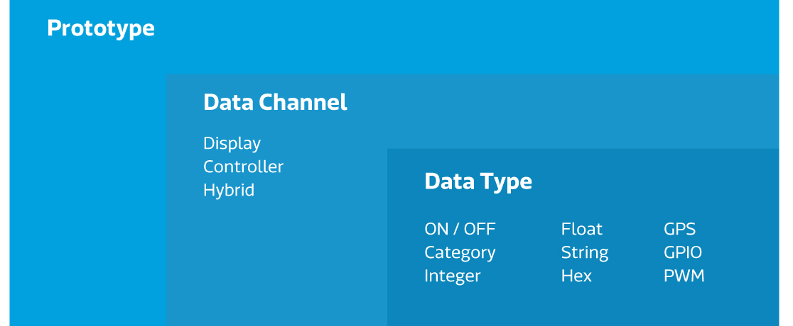
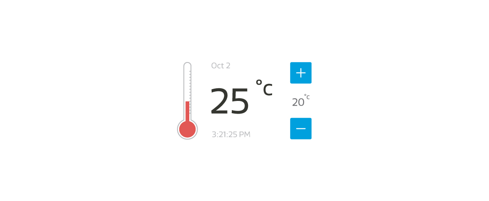

在這個章節，我們將介紹有關於MediaTek Cloud Sandbox 的一些基本概念，幫助您打造您的穿戴式和物聯網裝置。您可以在MCS的開發頁面，操作所有關於產品原型的開發的功能和服務。此外，您亦可在MCS的我的裝置頁面，看到所以您建立的或是有授權使用的裝置。

# **開發**

在開發頁面中，您可以建立一個或是多個的產品原型，並且為您的產品原型建立多個測試裝置來和您的實體裝置作連結。
每個產品原型內含有以下內容：

- **資料通道**，您可以替每個資料通道選擇一種資料型態類型來傳輸。
- **通知設定**，當裝置狀態改變到達預設時，發出通知。
- **使用者權限管理**，您可以管理您個別的產品原型和裝置的使用者權限，讓其他使用者能共同開發或瀏覽。
- **韌體管理**，您可以管理您產品原型的所有韌體，並決定是否更新至個別裝置。
- **測試裝置**，您可以將測試裝置和實體裝置作連結，來實現您的產品原型設計。

當您開發完產品原型後，就可以開始建立測試裝置與您的實體裝置作連結了。

## **產品原型**

**產品原型**是您開發裝置的藍圖。每個產品原型都具有獨特的Id和Key。

## **資料通道**

一個 **資料通道** 代表:
- 由MCS所儲存的由裝置的感應元件蒐集而來的資料，或是
- 透過MCS傳送給裝置的指令

這些資料通道可以分為以下幾類：
- 顯示器
- 控制器
- 綜合型顯示控制器

## **資料通道類別**

###**顯示器**

此類型的資料通道是專門儲存和顯示由裝置的感應元件蒐集而來的資料。例如從裝置感應元件上船而來的溫度，MCS會將此資料以時間序列方式儲存。

###**控制器**

此類型的資料通道是專門用來傳遞指令至裝置，已控制裝置內元件的狀態。例如控制燈的開或關。

###**綜合型顯示控制器**

此類型的資料型態能同時為顯示器和控制器。例如冷氣機的溫度顯示器，並且同時能控制冷氣的開關或是調整溫度。

## **資料型態**

每個資料通道都能用來傳輸以下的九種種資料型態的一種：

- **開/關** — 此類型的資料型態用來表示裝置的兩種狀態，使用者能選擇開啟或是關閉裝置的狀態。例如　一盞燈的開或關。

- **類別** — 此類型的資料型態能用來表示一個任Using this feature you can upload and manage the firmware for a specific prototype. Once devices have been created from the prototype the sandbox will detect compatible devices and offer their users the option to update the devices’ firmware over the air.意的類別。您能定義任何您想要的類別和此類別相對的內容。例如您能用來儲存星期，月份，或是風扇的狀態（關，慢速，中速，高速）。

- **整數** — 此類型的資料型態能用來表示任意的整數，例如某一個使用者一天走了多少步的數值。

- **浮點數** — 此類型的資料型態能用來表示任意的浮點數，例如氣溫。

- **字串** — 此類型的資料型態用來表示字串，例如裝置回傳的訊息。

- **十六進位數** — 此類型的資料型態用來表示十六進位數值，例如LED燈的顯示顏色。

- **GPS** — 此類型的資料型態用來表示地理位置，包含經度，緯度，和高度。

- **GPIO** — 此類型的資料型態用來表示GPIO的數位訊號。例如在Pin 4位置為High的訊號狀態。

- **PWM** — 此類型的資料型態用來表示傳遞到GPIO的PWM數位訊號, 例如在Pin 3位置的level 15訊號。

## **通知**

此功能可讓您定義觸發電子郵件或基於雲的通報標準，您身為裝置的擁有者，除了會無條件的收到通知外，還能透過設定使用者權限來使其他使用者也收到相同的通知。

觸發器可用於以下情況:

- 當某一個資料通道回傳的資料超過或是低於預設值，將會觸發通知條件，並且通知有權限的使用者。同時，資料質能然會被保存。

- 當控制器型態的資料通道的值被改片時，觸發通知。

## **使用者權限管理**

此功能讓您能夠給予其他MCS用戶各種訪問產品原型或是測試裝置的權限，如查看或是更改產品原型設置或是創建一個新的測試裝置。

## **韌體服務**

使用此功能，您可以上傳並管理特定產品原型的韌體。每當一個測試被新增時，MCS都會從原產品型中檢測能夠兼容的韌體，並提供用戶通過空中更新設備韌體的服務。

## **測試裝置**

此功能使您能夠從產品原型的詳細信息頁面中建立測試裝置。您創建的每個裝置都會有一個**DeviceId ** 和 **DeviceKey** ，此訊息當您在呼叫MCS所提供的API時將會需要用到。您亦可於**My Device** 頁面中查看裝置的DeviceId以及DeviceKey等詳細信息。

# **My Devices**

You use **My Devices** to manage the devices you have created or have been given access to.

In this page, you can see the data channel, user privilege, and notification configurations as defined in the device’s prototype. You can modify the notification and user privilege settings for specific devices on this page. You can also see the device Id and device key, in addition to being able to see those details in the Test device tab in a prototype’s details page.

In addition to listing all the devices created for your prototypes, this page also shows devices from other prototypes that you have been given the access to. The actions you can do to the devices vary depending on the privileges granted to you. For example, if you are a viewer of the device, you can only see the data and cannot make any change to the device.

