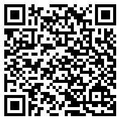
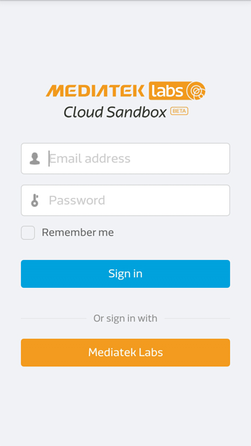
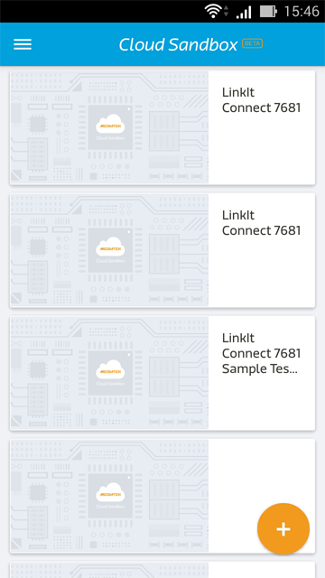
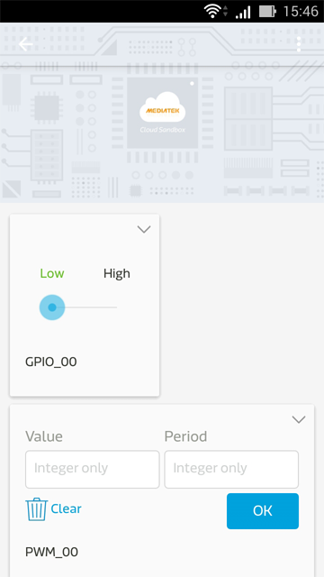
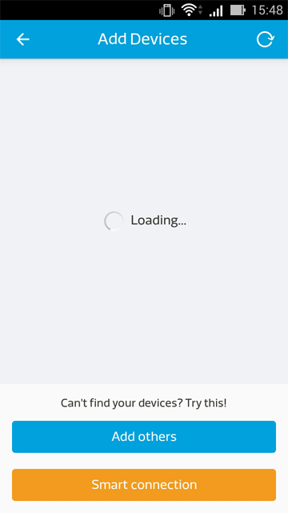

# Mobile application--cn
# 手機應用程式

請選擇 [Download here](https://s3.cn-north-1.amazonaws.com.cn/mtk.linkit/mcs-latest-production-release.apk) 或是 QR code 來取得我們提供的手機應用程式:

**(請注意：若您有使用 LinkIt connect 7681 裝置，請更新至最新版本才可繼續使用，請參考以下更新連結[7681 Firmware Update Instruction](../7681_firmware_update--cn/))**

目前此手機應用程式只提供安卓（Android）版本。

您必須確保您的安卓（Android）手機版本為 v4.0 以上，並且使用您的手機瀏覽器打開此下載頁面。

當您第一次安裝使用後，您會看到以下畫面：

一旦登入後，您將可以看到所有您建立的，或是有訪問權限的裝置。

您可以點擊裝置的詳細資料按鈕，來檢視您的裝置狀態：

您可以對控制器類型的資料通道下達指令，以改變他的最新狀態。目前手機無法和網頁板一樣顯示圖形化的資料。

此外，在畫面的左下方，您會看見一個加號，您可以點擊此加號來新建測試裝置。您亦可以使用 Smart Connection 功能來來接您的 LinkIt Connect 開發板。如欲查看更詳細的 LinkIt Connect 使用方式，您可以參考以下教程[2.Tutorial 2.7 Implementing using Linkit Connect 7681 development board](http://mcs.mediatek.com/resources/zh-TW/latest/tutorial/implementing_using_mt7681_development_board)

