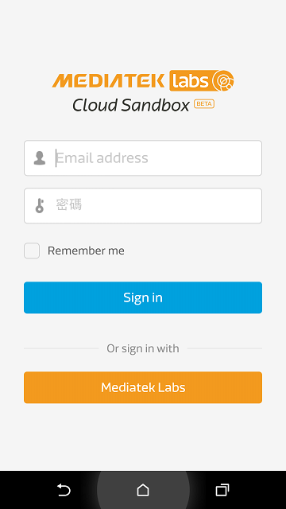
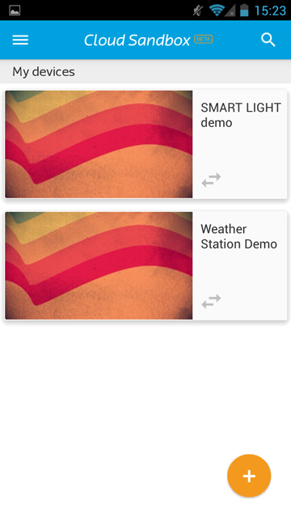
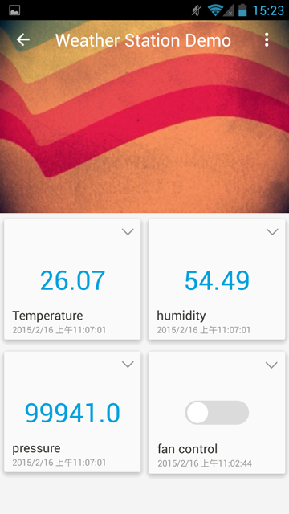
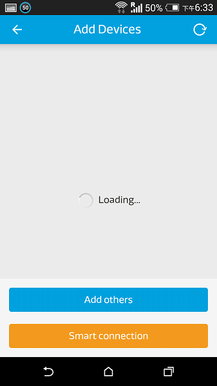

# 手機應用程式

您可以使用以下連結 [here](https://play.google.com/store/apps/details?id=com.mediatek.iotcloud) 或是QR code來下載我們提供的手機應用程式:

(請注意，若您已經安裝過舊的版本，且欲安裝新版，請先移除舊版再行安裝新版本)

目前此手機應用成是只提供安卓（Android）版本。

您必須確保您的安卓（Android）手機版本為v4.0以上，並且使用您的手機瀏覽器打開此下載頁面。

當您第一次安裝使用後，您會看到以下畫面：

一旦登入後，您將可以看到所有您建立的，或是有訪問權限的裝置。

您可以點擊裝置的詳細資料按鈕，來檢視您的裝置狀態：

您可以對控制器類型的資料通道下達指令，以改變他的最新狀態。目前手機無法和網頁板一樣顯示圖形化的資料。

此外，在畫面的左下方，您會看見一個加號，您可以點擊此加號來新建測試裝置。您亦可以使用Smart Connection功能來來接您的LinkIt Connect開發板。如欲查看更詳細的LinkIt Connect使用方式，您可以參考以下教程[2.Tutorial 2.7 Implementing using Linkit Connect 7681 development board](https://mcs.mediatek.com/v2console/supports/implementing_using_mt7681_development_board)

