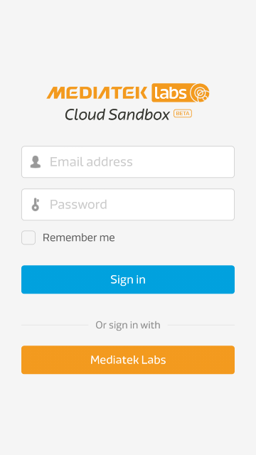
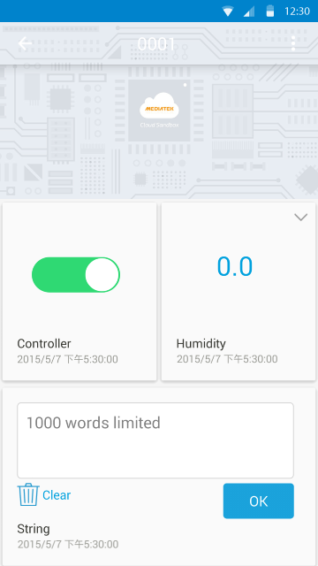

# 手機應用程式

請使用 [Google Play](https://play.google.com/store/apps/details?id=com.mediatek.iotcloud) 或是 QR code 來取得我們提供的手機應用程式:

**(請注意：為了增加效能和安全性，我們將系統全面升級。舊版本的手機應用程式將不再能使用，請於 Google play 商店下載最新版本的手機應用程式來連結您的手機與 MCS 平台。同時，若您有使用 LinkIt connect 7681 裝置，請更新至最新版本才可繼續使用，請參考以下更新連結[7681 Firmware Update Instruction](../7681_firmware_update/))**

或是，您可以選擇 [直接下載 apk](https://s3-ap-southeast-1.amazonaws.com/mtk.linkit/mcs-2.5.0-production-release.apk)。

目前此手機應用程式只提供安卓（Android）版本。

您必須確保您的安卓（Android）手機版本為 v4.0 以上，並且使用您的手機瀏覽器打開此下載頁面。

當您第一次安裝使用後，您會看到以下畫面：

一旦登入後，您將可以看到所有您建立的，或是有訪問權限的裝置。

您可以點擊裝置的詳細資料按鈕，來檢視您的裝置狀態：

您可以對控制器類型的資料通道下達指令，以改變他的最新狀態。目前手機無法和網頁板一樣顯示圖形化的資料。

此外，在畫面的左下方，您會看見一個加號，您可以點擊此加號來新建測試裝置。您亦可以使用 Smart Connection 功能來來接您的 LinkIt Connect 開發板。如欲查看更詳細的 LinkIt Connect 使用方式，您可以參考以下教程[2.Tutorial 2.7 Implementing using Linkit Connect 7681 development board](http://mcs.mediatek.com/resources/zh-TW/latest/tutorial/implementing_using_mt7681_development_board)

