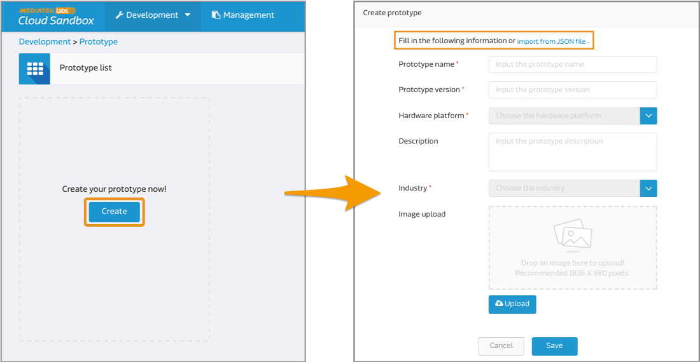
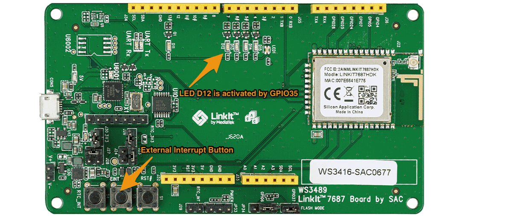

# 控制 LinkIt 7687 上的 LED 燈

這個範例中，我們將會展示如何使用 GCC 將 LinkIt 7687 與 MCS 連線。讓您可以從 MCS 網頁上遠端控制 LinkIt 7687 LED 燈的明滅，並且在網頁上看到由 LinkIt 7687 傳回來的時間字串。

## 輕鬆上手
1. 首先，下載我們預先準備好的[範例程式](https://github.com/Mediatek-Cloud/mcs.c-examples/archive/master.zip)。在本篇範例中，我們使用的是 **mcs\_gpio\_interrupt\_mqtt** 這個專案，所以下載完成後請將此資料夾複製到 **app** 這個路徑下。

	```
	{SDK_Root}/project/mt7687_hdk/apps/mcs_gpio_interrupt_mqtt
	```

2. 接著在 MCS 網頁上建立您的產品原型與資料通道。您可以透過匯入我們預先準備好，附帶在範例中的 **mcs\_gpio\_interrupt\_mqtt\_prototype.json** 檔案直接建立相同的原型。

	```
	{SDK_Root}/project/mt7687_hdk/apps/mcs_gpio_interrupt_mqtt/mcs_gpio_interrupt_mqtt_prototype.json
	```
	這個產品原型包含了兩個資料通道：
	
	* 開關控制器: 資料通道 ID 為 "switch"
	* 字串顯示器: 資料通道 ID 為 "message"
	
	
	
	> **如果您需要更詳盡的步驟與說明，請參考[建立您的第一個產品原型](https://mcs.mediatek.com/resources/latest/tutorial/getting_started#create-your-first-prototype)。**
	
3. 在 MCS 網頁上建立您的測試裝置。

	
	> **如果您需要更詳盡的步驟與說明，請參考[創建您的第一個測試裝置](https://mcs.mediatek.com/resources/latest/tutorial/getting_started#create-your-first-test-device)。**
	
4. 建立測試裝置後，頁面上會顯示一組裝置的 ID 與 key，請將這組資料資訊更新到  **mcs.h** 檔案中。

	
	
	```
	/* Modify mcs_gpio_interrupt_mqtt/inc/mcs.h according to your MCS configuration */ 
	
 	#define DEVICEID "DbH****"
 	#define DEVICEKEY "TPJVm3Dy********"
 	#define HOST "com"
	```
	
5. 更改 **main.c** 檔案中的產品原型與環境設定變數。

	* LinkIt 7687 開發板的網路連線設定：
		* AP_SSID: 無線網路連線的 SSID。
		* AP_PWD: 無線網路連線的密碼。

	* 資料通道的相關資訊：
		* GPIO_ON: "switch,1" (switch 是步驟 2 建立的資料通道 ID)
		* GPIO_OFF: "switch,0" (switch 是步驟 2 建立的資料通道 ID)

	```
	#define AP_SSID "your_SSID"  
	#define AP_PWD "your_pwd"
	#define GPIO_ON "switch,1"
	#define GPIO_OFF "switch,0"
	```
	
6. 在更改完 **mcs.h** 與 **main.c** 檔案後，您就可以開始使用 GCC 命令列工具編譯並建置這個專案囉。

	* 切換目錄到此專案的 GCC 資料夾下。
		
		```
		$ cd <sdk_root>/project/mt7687_hdk/app/mcs_gpio_interrupt_mqtt/GCC
		```
	* 執行 make 指令。
		
		```
		$ make
		```
	* 建置後的檔案會產生在此專案的 **GCC/build** 資料夾下。		
		```
		<sdk_root>/project/mt7687_hdk/app/mcs_gpio_interrupt_mqtt/GCC/build  
		```
		
	> **如果您需要更詳盡的步驟與說明，請參考[建置範例專案](https://docs.labs.mediatek.com/resource/mt7687-mt7697/en/get-started-linkit-7687-hdk/gcc-arm-embedded-command-line-tools-free/build-an-example-project)。**
	
7. 最後，就可以直接將建置後的檔案下載到您的 LinkIt 7687 HDK 裡了。下載時所需要的 scatter 與二進制 (binary) 檔案都位於先前產生出來的 **GCC/build** 資料夾下。

	> **如果您需要更詳盡的步驟與說明，請參考[下載二進位檔案至開發板](https://docs.labs.mediatek.com/resource/mt7687-mt7697/en/get-started-linkit-7687-hdk/gcc-arm-embedded-command-line-tools-free/download-a-pre-built-binary-example)。**

在以上所有的步驟都順利完成後，您便可開啟瀏覽器，前往 MCS 網頁 > 測試裝置詳情頁面遠端開關 LinkIt 7687 HDK 上的 **D12** LED 燈泡。

此外，如果你按下 LinkIt 7687 HDK 上的 **EINT (External Interrupt Button)** 按鈕，便會觸發 LinkIt 7687 HDK 將當前的系統時間上傳到 MCS 上。


