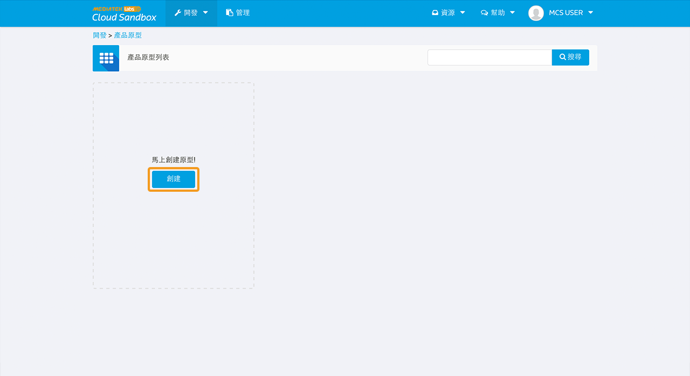
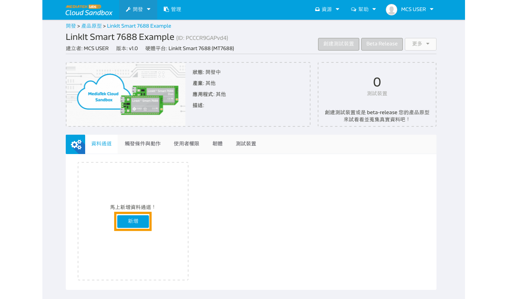
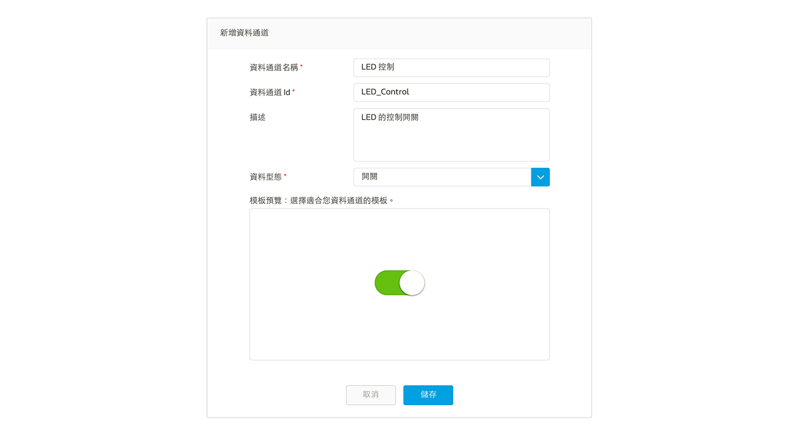
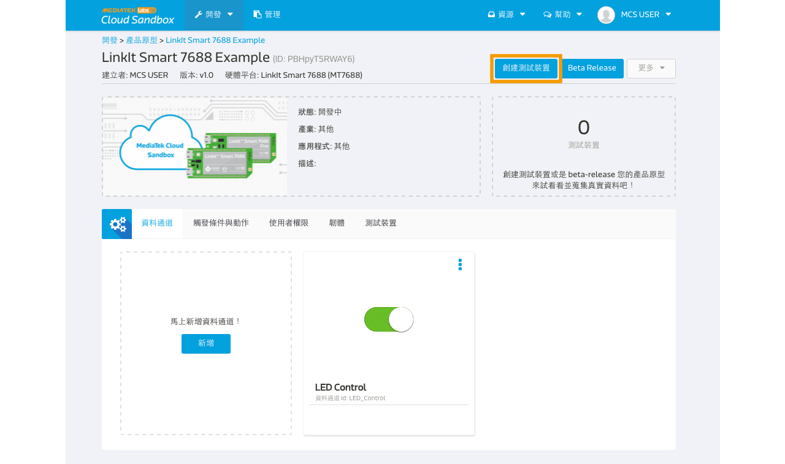
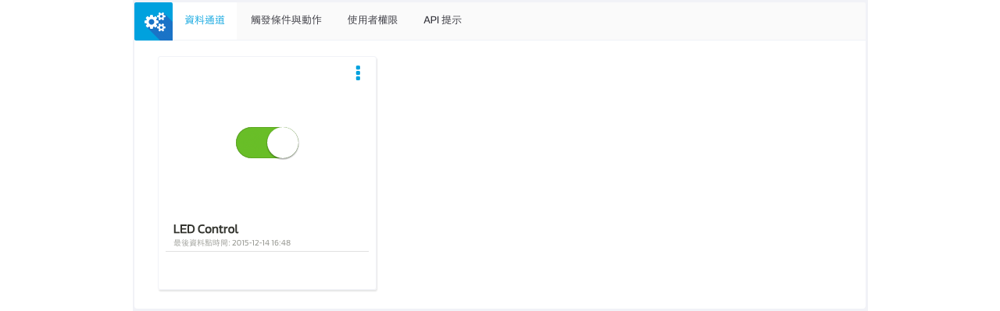
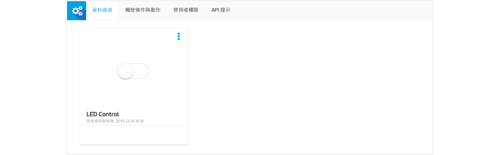

# Simple Switch Tutorial

In this guide you’ll learn the steps to create a simple remote switch that allows you to turn on and off the on-board Wi-Fi LED from the web console of MCS using Node.js or python.

## Creating a new prototype for LinkIt Smart 7688

### Step 1. Create a new Prototype with Switch-Type data channel

a. After login, select "Prototype" under Development at the navigator bar, click "Create" to create a new prototype.



b. Fill in the detail information as per screen to give a basic profile of this prototype:


c. Click "Detail" for the prototype created


d. In the prototype Detail Page, select "Data Channel" TAB and click "Add" to create new Data Channel:




We are going to create two Data Channel for this tutorial, one is a Display Data Channel to reflect the status of the LED light on the board; one is a Controller Data Channel that issues command to the board to switch the LED light:


e. Select "Controller" Data Channel and key in the following information




Please take note of the Data Channel Id, this is the unique identifier when calling API later in the tutorial.


### Step 2. Create Test Device

a. Click "Create Test Device" on the right upper corner of the page



b. Fill in the name and description of the test device:


c. After Test device is created, click "Go to detail" to open the created device detail page:




Please take note of the deviceId and deviceKey for calling API later in the tutorial.

### Step 3. Obtain Device ID, Device Key, Data Channel ID
Here is the summary of the neccessary information we have obtained in interacting with this test device. You can find the information in the test device detail page.

| Name | Value | Remark |
| --- | --- | --- |
| deviceId | Dsre1qRQ | Unique Identifier for this Test Device, copy your own deviceId in the device detail page. |
| deviceKey | DFbtsNWg4AuLZ30v  | Unique API Key for this Test Device, copy your own deviceKey in the device detail page. |
| dataChannelId | LED_Control | Data Channel Id for LED control |

Note 1: The deviceId and deviceKey shown here will be differet to yours, please use your obtained value instead.

Note 2: The deviceId are case sensitive.


# Creating a program to connect to MCS and run the application

MCS supports node.js and python. You can choose node.js or python base on your preference.

## Creating a Node.js program to connect to MCS

Here is the Node.js example code that listens for commands from MCS web console.

1. Create a file app.js using an editor, vi is used in this example:
```
vim app.js
```

2. Type **i** and Copy/paste the following code in the editor
```
    var mcs = require('mcsjs');
	var myApp = mcs.register({
		deviceId: 'ABC123',
		deviceKey: 'XYZ123',
	});
	// Replace the device ID and device Key obtained from your test device
	// created in MCS.

	myApp.on('LED_Control', function(data, time) {
		if(Number(data) === 1){
			console.log('blink');
		} else {
			console.log(’off’);
		}
	});
```

Next, run the Node.js example program.

### Run your application
You are now ready to execute the Node.js program. In the system console, type the following command:(# is command prompt and is not part of command.)


```
# node app
```

Go to MediaTek Cloud Sandbox and use the controller panel to flip the button on and off and watch the Wi-Fi LED on LinkIt Smart LinkIt Smart 7688 HDK.





## Creating a python program to connect to MCS

Here is the Python code example that listens for commands from MCS web console. The example is explained in steps and the complete example code is presented in the last step.

* Establish command pipe to MCS
* Send heart beat to TCP socket
* Parse the command
* Complete example code


#### Establish command pipe to MCS
To establish a command pipe to MCS, you need to create a TCP socket that connects to the command server. To connect to command server, you need to query the IP address and port of the command server by calling a RESTful API from MCS.

```
	DEVICE_INFO = {'device_id' : 'YOUR_DEVICE_ID',
			'device_key' : 'YOUR_DEVICE_KEY'
	}

	# change 'INFO' to 'WARNING' to filter info messages
	logging.basicConfig(level='INFO')

	def establishCommandChannel():
	# Query command server's IP & port
	connectionAPI =

	'https://api.mediatek.com/mcs/v2/devices/%(device_id)s/connections.cs		v'
	r = requests.get(connectionAPI % DEVICE_INFO,
		headers = {'deviceKey' : DEVICE_INFO['device_key'],
			'Content-Type' : 'text/csv'})
	logging.info("Command Channel IP,port=" + r.text)
	(ip, port) = r.text.split(',')

	# Connect to command server
	s = socket.socket(socket.AF_INET, socket.SOCK_STREAM)
	s.connect((ip, int(port)))
	s.settimeout(None)

```

After the TCP socket is connected to the command server, the server will send commands that reflects the status of the web console, such as the status of the ON/OFF switch. However, MCS requires you to send a heart beat to the command server every minute in order to keep the TCP socket active. You’ll learn to do that in the next step.


#### Send heart beat to TCP socket
Create a Python program that sends heart beat to TCP command every 40 seconds using threading module.

```
	# Heartbeat for command server to keep the channel alive
	def sendHeartBeat(commandChannel):
		keepAliveMessage = '%(device_id)s,%(device_key)s,0' % 				DEVICE_INFO
		commandChannel.sendall(keepAliveMessage)
		logging.info("hear beat")

	def heartBeat(commandChannel):
		sendHeartBeat(commandChannel)
		# Re-start the timer periodically
		threading.Timer(40, heartBeat, [commandChannel]).start()
		threading.Timer(40, heartBeat, [s]).start()
		sendHeartBeat(s)


```

#### Parse the command

The server sends commands in the following format:  deviceId, deviceKey, timestamp, dataChannelId, and commandValue. You can use comma “,” to parse these commands. You also need to check the command type by their length because the server echoes heart beat command back to the device.

```
	while True:
	command = commandChannel.recv(1024)
	logging.info("recv:" + command)
	# command can be a response of heart beat or an update of the 	LED_control,
	# so we split by ',' and drop device id and device key and check 	length
	fields = command.split(',')[2:]

	if len(fields) > 1:
		timeStamp, dataChannelId, commandString = fields
	if dataChannelId == 'LED_control':
	# check the value - it's either 0 or 1
		commandValue = int(commandString)
		logging.info("led :%d" % commandValue)


```

Please refer to [MCS API](https://mcs.mediatek.com/resources/latest/api_references/) for more information.

#### Complete example code
The complete example code is presented below.  Create a file mcs_blink.py in the system console and copy/paste the example code.

The following is used in the example:
* Device ID:ABC123
* Device Key:XYZ123

Replace the above with your device ID and device key.

```
	import requests
	import socket
	import threading
	import logging
	import mraa

	# change this to the values from MCS web console
	DEVICE_INFO = {

		'device_id' : 'ABC123',
		'device_key' : 'XYZ123'

	}
	# change 'INFO' to 'WARNING' to filter info messages
	logging.basicConfig(level='INFO')
	heartBeatTask = None
	def establishCommandChannel():
	# Query command server's IP & port
	connectionAPI =
	'https://api.mediatek.com/mcs/v2/devices/ABC123/connections.csv'
	r = requests.get(connectionAPI % DEVICE_INFO,
		headers = {'deviceKey' : DEVICE_INFO['device_key'],
				'Content-Type' : 'text/csv'})
	logging.info("Command Channel IP,port=" + r.text)
	(ip, port) = r.text.split(',')

	# Connect to command server
	s = socket.socket(socket.AF_INET, socket.SOCK_STREAM)
	s.connect((ip, int(port)))
	s.settimeout(None)

	# Heartbeat for command server to keep the channel alive
	def sendHeartBeat(commandChannel):
		keepAliveMessage = 'ABC123,XYZ123,0' % DEVICE_INFO
		commandChannel.sendall(keepAliveMessage)
		logging.info("beat:%s" % keepAliveMessage)
	def heartBeat(commandChannel):
		sendHeartBeat(commandChannel)
		# Re-start the timer periodically
		global heartBeatTask
		heartBeatTask = threading.Timer(40, heartBeat, 					[commandChannel]).start()

	heartBeat(s)
	return s
	def waitAndExecuteCommand(commandChannel):
	while True:

		command = commandChannel.recv(1024)

	logging.info("recv:" + command)
	# command can be a response of heart beat or an update of the 	LED_control,
	# it’s split by ',' and drop device ID and device key and check 	length
	fields = command.split(',')[2:]

	if len(fields) > 1:
		timeStamp, dataChannelId, commandString = fields
		if dataChannelId == 'LED_control':
			# check the value - it's either 0 or 1
			commandValue = int(commandString)
			logging.info("led :%d" % commandValue)
			setLED(commandValue)
	pin = None
	def setupLED():
	global pin
	# on LinkIt Smart 7688, pin 44 is the Wi-Fi LED.
	pin = mraa.Gpio(44)
	pin.dir(mraa.DIR_OUT)
	def setLED(state):
	# Note the LED is "reversed" to the pin's GPIO status.
	# So you need to reverse it here.

		if state:
			pin.write(0)
		else:
		pin.write(1)
	if __name__ == '__main__':
		setupLED()
		channel = establishCommandChannel()
		waitAndExecuteCommand(channel)


```

The LED value is set based on the commands value. Please refer to Chapter 5, “Peripheral programming on LinkIt Smart 7688" for more information on how to control the LEDs using mraa. Note that the Wi-Fi LED is turned ON when the GPIO 44 is set to LOW.

### Run your application
You are now ready to execute the Python program. In the system console, type the following command:# is command prompt and is not part of command.

```
# python blink.py
```

Go to MediaTek Cloud Sandbox and use the controller panel to flip the button on and off and watch the Wi-Fi LED on LinkIt Smart LinkIt Smart 7688 HDK.


