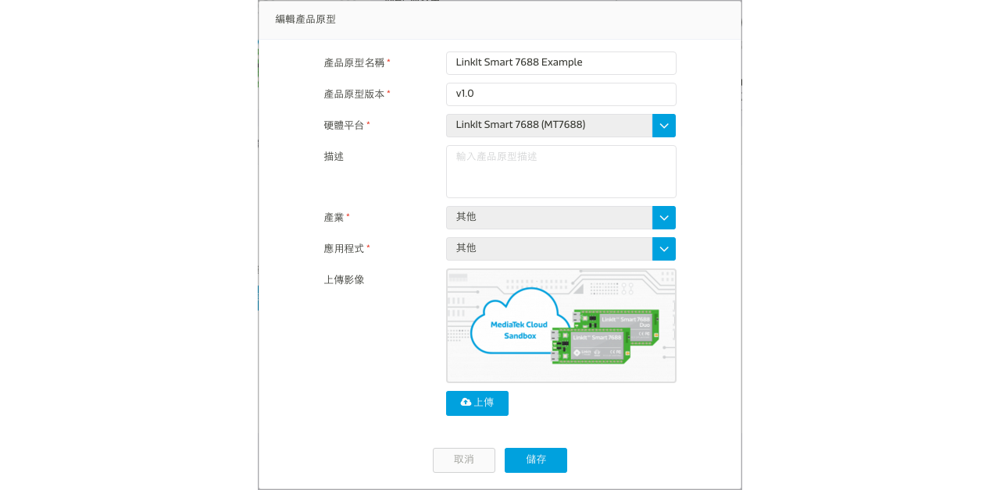

# Video Stream Tutorial

Here is a simple example for live streaming on MCS!

We will guide you how to create a video stream data channel on MCS web console and set up a video converter on LinkIt Smart 7688 to transcode and start streaming.

## Create a new prototype for LinkIt Smart 7688

### Step 1. Create a new prototype with video stream data channel

a. After login, select "Prototype" under "Development" at the navigation bar and click "Create" to create a new prototype or [import from json](http://cdn.mediatek.com/tutorial/7688/7688_video_TW.json). If you import the prototype from json, you can skip Step 1 and start from Step 2.


b. Fill in the detail information as per screen to give a basic profile of this prototype.



c. Click "Detail" for the prototype created.


d. In the prototype Detail Page, select "Data Channel" TAB and click "Add" to create new Data Channel.


We would like to add a **video stream** data channel which can display the live streaming grabbed by your LinkIt Smart 7688.

e. Select "Display" type of Data Channel and fill in the following information.


Please take note of the Data Channel ID which you just filled in, you will need this unique identifier when calling API later in the tutorial.

### Step 2. Create Test Device

a. Click "Create Test Device" in the upper-right corner of prototype detail page.


b. Fill in the name and description of the test device.


c. After the test device is created, click "Go to detail" to visit the device detail page.


Please take note of the deviceId and deviceKey, you will need this information when calling API later in the tutorial.

### Step 3. Obtain Device ID, Device Key and Data Channel ID

Here is the summary of the necessary information we have obtained in interacting with this test device:

| Name | Value | Remark |
| --- | --- | --- |
| deviceId | Dsre1qRQ | Unique Identifier for this Test Device |
| deviceKey | DFbtsNWg4AuLZ30v  | Unique API Key for this Test Device |
| dataChannelId | Video | Data Channel Id for image display data channel|

Note 1: The deviceId and deviceKey shown here will be different to yours, please use your obtained value instead.

Note 2: The deviceId is case sensitive.


# Developing a program on your device to connect with MCS

## Pre-requisite

* LinkIt Smart 7688 or LinkIt Smart 7688 Duo
* a USB OTG cable
* a USB charging cable
* a web camera (in this tutorial, we use the Logitech C310)
* Connect the micro-USB end of the charging cable to PWR port on the 7688 development board and the USB end to your computer.
* Use USB OTG cable to connect your web camera to the USB HOST port on the 7688 development board.


## Set up the device

1. Make sure the 7688 development board has been switched to station mode and connect to the same network as your computer successfully.
2. Connect to the console of 7688 development board through `ssh` command on your computer.
```
ssh root@mylinkit.local
```

3. Install FFmpeg package on the 7688 development board.
```
opkg update
opkg install ffmpeg
```

4. Install necessary Node.js package on the 7688 development board.
```
mkdir app && cd app && npm init
npm install mcsjs --save
```

5. Test if FFmpeg can send streaming content to MCS successfully.
```
ffmpeg -s 176x144 -f video4linux2 -r 30 -i /dev/video0 -f mpeg1video -r 30 -b 800k http://stream-mcs.mediatek.com/:deviceId/:deviceKey/:dataChnId/176/144
```

The :deviceId, :deviceKey and :dataChnId need to be replaced with the real value you just obtained. You also need to specify the video resolution in the URL. In this example, the resolution is 176x144.
You can view on either MCS web console or App to make sure the video stream works.

## Developing a Node.js program to connect with MCS

### Create your program

You are now ready to write the Node.js program on the 7688 development board.

1. Create a file called app.js using an editor, vi is used in this example:
```
vim app.js
```

2. Type **i** and copy/paste the following code in the editor. Please remember to replace the deviceId, deviceKey and dataChnId to the real values.
```
var mcs = require('mcsjs');
var exec = require('child_process').exec;
var deviceId = 'Input your deviceId';
var deviceKey = 'Input your deviceKey';
var dataChnId = 'Input your `video stream` data channel Id';
var width = 176;
var height = 144;
var myApp = mcs.register({
  deviceId: deviceId,
  deviceKey: deviceKey,
});
exec('ffmpeg -s ' + width + 'x' + height + ' -f video4linux2 -r 30 -i /dev/video0 -f mpeg1video -r 30 -b 800k http://stream-mcs.mediatek.com/' + deviceId + '/' +deviceKey + '/' + dataChnId + '/' + width + '/' + height, function(error, stdout, stderr) {
  console.log('stdout: ' + stdout);
  console.log('stderr: ' + stderr);
  if (error !== null) {
    console.log('exec error: ' + error);
  }
});
```

### Run your program

Let's execute the Node.js program. In the 7688 system console, type the following command
```
node app
```

and go to MCS and will see the video streaming shown in the video stream data channel.


