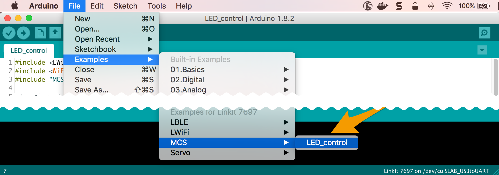
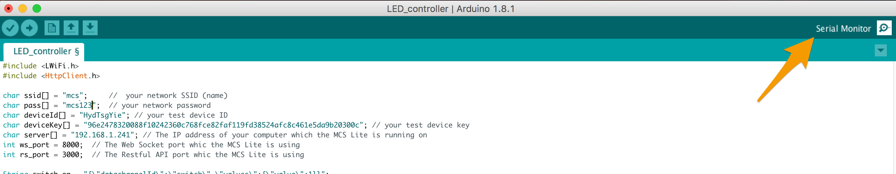
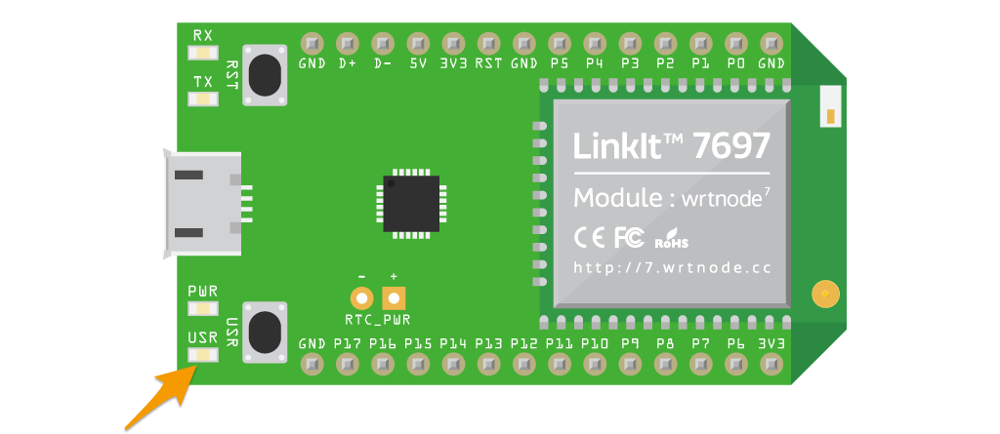

# 控制 LinkIt 7697 上的 LED 燈號

這個範例講述如何透過使用 MCS 函式庫讓您的裝置連上 MCS 雲端服務，並且在 MCS 網站上開關 LinkIt 7697 開發板上的 LED 燈。

## 建立您的 MCS 測試裝置
首先，使用瀏覽器開發 [MCS 主控台頁面](https://mcs.mediatek.com)，並且建立產品原型，資料通道與測試裝置。在這個範例中，您需要定義以下兩個資料通道：

1. 一個**控制器**，其資料型態為**開關**
2. 一個**顯示器**，其資料型態為**開關**

如果您想了解更多有關於如何建立產品原型，資料通道與測試裝置的方法，請參考 [MCS 入門導覽](http://mcs.mediatek.com/resources/latest/tutorial/getting_started)。

## 使用 MCS 函式庫開發

要將裝置連上 MCS 雲端服務，首先需要建立一個 **MCSDevice** 物件，並給定測試裝置的 ID 與 key 資訊，然後再建立對應的資料通道。

1. 在 Arduino IDE 中, 選擇 **File** > **Examples** > **MCS**，然後選擇 **LED_control** 範例。

	

2. 接著，開始修改範例程式碼。要使用 MCS 雲端服務，裝置並須先能連上 Wi-Fi，因此先將您正在使用的 Wi-Fi 熱點的資訊設定到 **SSID** 與 **password** 參數中。

	```arduino
	// Assign AP ssid/password here
	#define _SSID "your_ssid"
	#define _KEY  "your_password"
	```

3. 在 **MCSDevice** 建構子中帶入 MCS 測試裝置的 **device ID** 與 **device key**。

	```arduino
	// Assign device id/key of your test device
	MCSDevice mcs("your_device_id", "your_device_key");
	```
	

4. 在初始化資料通道物件時，帶入 **data channel IDs**。

	```arduino
	// Assign data channel ID
	MCSControllerOnOff led("your_channel1_id");
	MCSDisplayOnOff    remote("your_channel2_id");
	```

	


## 執行應用程式

1. 點擊 **Upload** 將修改後的程式上傳到 LinkIt 7697 開發板上並等待 **Done Uploading** 上傳完成的訊息。

	

2. 點擊工具列中的 **Serial Monitor** 圖示，並且將 Serial Monitor 的**資料傳送的速率(Baud rate)** 改成 **9600**。

	

3. 接著，您就可以在 MCS 網站的裝置詳情頁面操作**開關控制器**來控制開發板上 LED 燈號的明滅了。同時，開發板在收到開關指令時，也將收到的數據再上傳回到 MCS 的 **開關顯示器**資料通道。

	

4. 觀察開發板上的 **LED PIN 7** 燈號. 這顆 LED 燈泡會隨著您在 MCS 網站上操作的產生明滅的效果。

	


## 程式碼解說
在這個範例中，我們使用了 **MCS 函式庫**來實作 LinkIt 7697 與 MCS 雲端服務的連線與互動，因此第一步就是先宣告載入 MCS 函式庫。

```arduino
#include <MCS.h>
```

宣告 **MCSControllerOnOff** 與 **MCSDisplayOnOff** 兩個資料通道的物件，他們分別代表了先前您在 MCS 網頁上建立的**開關控制器**與**開關顯示器**資料通道，在宣告物件的時候，需要將對應的資料通道 ID 帶入。

```arduino
MCSControllerOnOff led("your_channel1_id");
MCSDisplayOnOff    remote("your_channel2_id")
```

接著，我們要將這個實體裝置與 MCS 網頁上建立的測試裝置連結。因此在宣告 **MCSDevice** 物件時帶入您在 MCS 網頁上建立的測試裝置的 ID 與 key。

```arduino
MCSDevice mcs("your_device_id", "your_device_key");
```

透過 **addChannel()** 函式將先前宣告的資料通道加入 **MCSDevice** 物件底下。呼叫 **MCSDevice** 物件的 **connect()** 函式建立裝置與 MCS 雲端服務的 TCP 連線。


```arduino
  // setup MCS connection
  mcs.addChannel(led);
  mcs.addChannel(remote);
  while(!mcs.connected())
  {
    Serial.println("MCS.connect()...");
    mcs.connect();
  }
```

在 loop() 迴圈當中，透過資料通道物件的 **update()** 函式來檢查此開關控制器是否有接受到新的資料，如果有，則將接收到的數值設定給 **LED_PIN**，以此來控制 LED 燈號的明滅。


```arduino
if(led.updated())
  {
    Serial.print("LED updated, new value = ");
    Serial.println(led.value());
    digitalWrite(LED_PIN, led.value() ? HIGH : LOW);
    if(!remote.set(led.value()))
    {
      Serial.print("Failed to update remote");
      Serial.println(remote.value());
    }
  }
```
