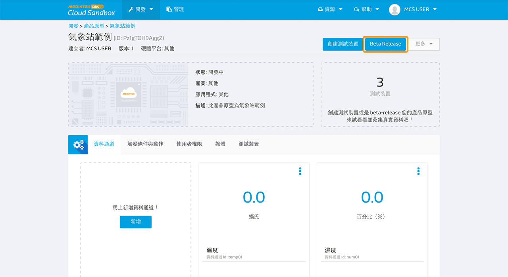
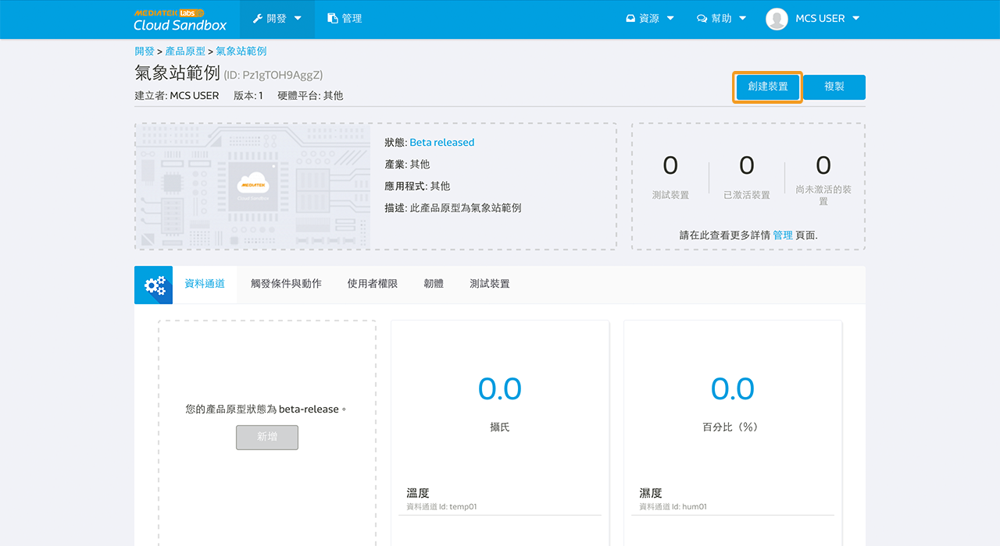
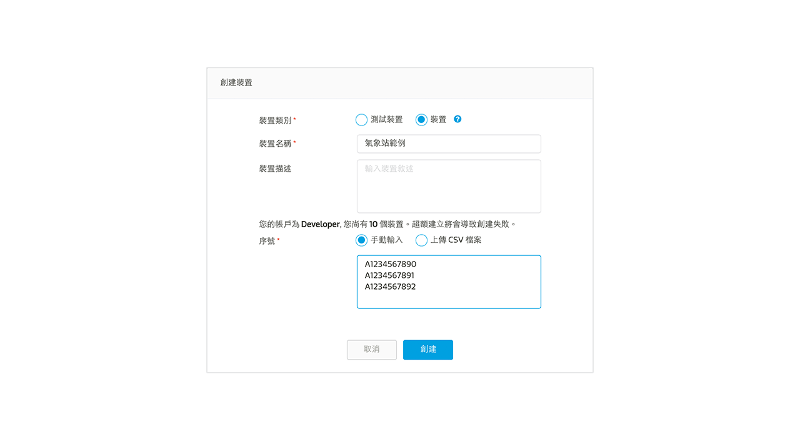
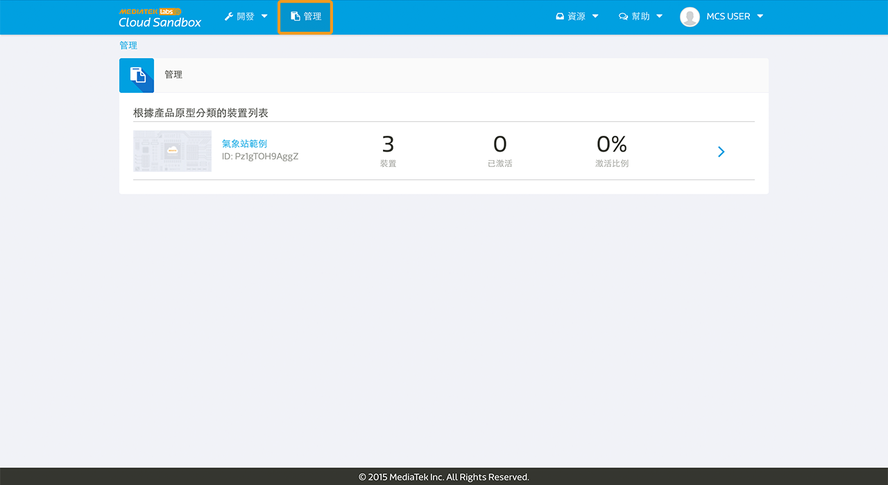
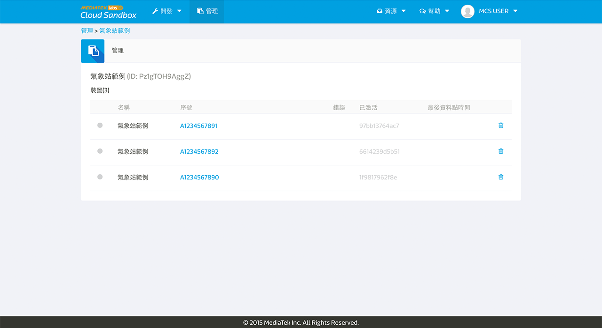

# Beta-Release 產品原型
當產品原型已經過充分的測試後，開發者可以透過發行此產品原型的 Beta 版本給少量的外部使用者測試。

產品原型進入 Beta-Release 後，此產品原型將被鎖定，意即開發者無法再針對此原型做任何的修改，包含原型資訊，資料通道，觸發條件與動作。然而，開發者依然可以新增參與開發的使用者或上傳韌體來進行測試裝置的韌體更新。

## 如何 Beta-Release 產品原型
您可點擊在產品原型頁面中右上角的 **Beta-Release** 按鈕來發行 Beta 版本。

# 創建裝置
當產品原型的設計已被確認且進入 Beta-Release 階段，開發者可選擇一次創建所有的裝置或是根據需求於日後逐步新增裝置。

在**管理**頁面中的裝置列表是按照產品原型分類，開發者可以在此管理所創建的裝置。此外，每個裝置皆有配發一個獨有的啟用碼，在開始使用此裝置之前使用者必須先完成裝置的啟用程序。

## 如何創建裝置
您可選擇一次創建所有的裝置或是根據需求於日後逐步新增。此外，創建裝置時必須輸入裝置序號，您可以手動輸入或直接匯入預先定義好的 csv 檔案。

步驟一：在產品原型進入 Beta-Release 階段後，按下產品原型頁面右上方的**創建裝置**按鈕。

步驟二：輸入裝置名稱與描述。

步驟三：輸入裝置的序號。序號的格式限制為 A-Z, a-z, 0-9 並且少於 50 個字元。

步驟四：按下**創建**按鈕。

創建後的裝置仍是處於非啟用狀態。每個裝置配發有一個獨有的啟用碼，在開始使用此裝置之前必須先完成裝置啟用程序。裝置啟用後，將會獲得一組專有的 deviceId 以及 deviceKey。

開發者可以透過**管理**頁面來查找裝置的啟用碼以及裝置的其他的相關資訊。

# 裝置管理
開發者可以在**管理**頁面當中管理所有創建的裝置。

在**管理**頁面中，開發者可以看到各個產品原型中目前裝置的數量，啟用的比例等。

同時，亦可更進一步的觀看單一產品原型下每個裝置的詳細資訊。其中包含有：

* 裝置連線狀態
* 裝置序號
* 裝置啟用碼
* 裝置啟用日期
* 裝置最近一次上傳資料的時間

請注意，無論測試裝置或啟用與尚未啟用的裝置皆受到免費開發者帳戶的用量限制。然而裝置，只有在非啟用狀態之下才能進行刪除。

## 如何啟用裝置

您可以在**管理**頁面中找到裝置的啟用碼，並用此啟用該裝置。

開發者可藉由 Mediatek Cloud Sandbox 所提供的 API 來啟用 Beta 裝置，使用方法請參閱 API 參考資料集當中的**裝置啟用** [這裡](../api_references/)。
開發者可以根據我們所提供的 API 自行設計裝置啟用的流程。

當裝置完成啟用後，您將可以在頁面上看到裝置的完整資訊，包含 deviceId, deviceKey，資料通道數據，觸發條件與動作以及韌體的版本。
