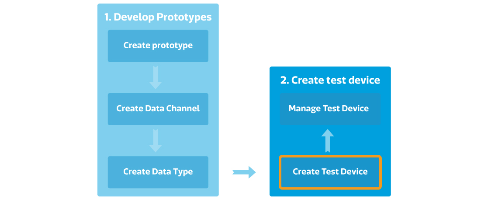

# 創建您的第一個測試裝置

## 創建測試裝置逐步導引

[事前準備] 您必須先完成開發產品原型

步驟一，點選產品原型的詳情按鈕。

步驟二，點選畫面上方的創建測試裝置按鈕。

步驟三，再跳出來的創建測試裝置對話窗中，輸入測試裝置名稱和描述，然後點擊確定按鈕。

步驟四，您將會看到創建成功的訊息。您可以直接點擊詳細資料按鈕連
接至測試裝置詳情頁面。

步驟五，您亦可於產品原型頁面中的**測試裝置分頁**內查看屬於此產品原型的測試裝置。

請注意，您測試裝置中所有的資料通道都是由產品原型繼承而來的。如果您在產品原型中更新了資料通道，此更新亦會同時反映至所有屬於此產品原型的測試裝置。

## 如何取得裝置的DeviceId和DeviceKey

當您創建好測試裝置後，您可以查看或是控制您的裝置來確保在正式商轉前產品的功能穩定性。

您能夠在兩個地方找到測試裝置的DeviceId和DeviceKey：

1. 產品原型頁面中的**測試裝置分頁**。
2. 測試裝置詳細資料頁面中。

測試裝置的DeviceId和DeviceKey是用來呼叫API時必須使用到的參數。在測試裝置詳細資料頁面中，您會看到藍色字體的DeviceId和DeviceKey編號，單擊藍色編號，將會立即複製至您的剪貼布。

