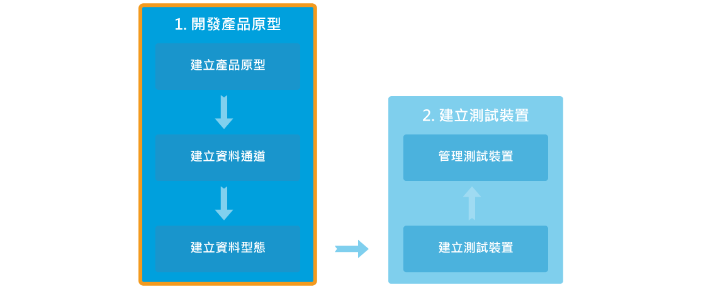

# 建立您的第一個產品原型

## 建立產品原型逐步導引

步驟一，點擊畫面上方的開發連結。

步驟二，點擊創建按鈕。

步驟三，輸入產品原型名稱，版本，並選擇硬體平台，產業，之後點擊儲存按鈕。
您的產品原型已建立。

步驟四，點擊您剛建立的產品原型內的詳情按鈕。

當您建立好產品原型後，您可以開始建立資料通到，通知，設定使用者權限，並且新增測試裝置了。

步驟五，點擊新增資料通道分頁中的新增按鈕。

步驟六，選擇資料通道型態。例如控制器，顯示器，或是綜合型控制顯示器。之後點選新增按鈕。

步驟七，輸入資料通道名稱，資料通到ID，描述，並選擇資料型態。

步驟八，點擊儲存按鈕。您現在可以為您的產品原型建立測試裝置了！

如果您需要了解更多關於資料通道或是資料型態的詳細信息，您可以參考資源中的核心概念章節。

