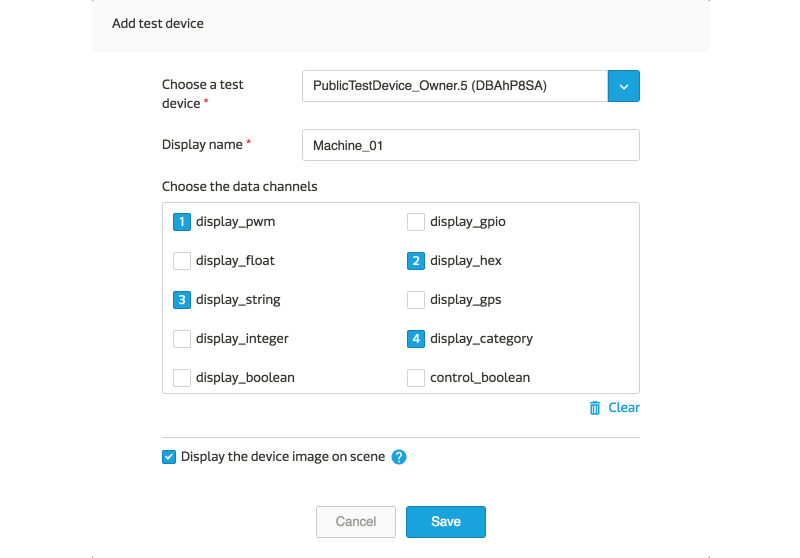
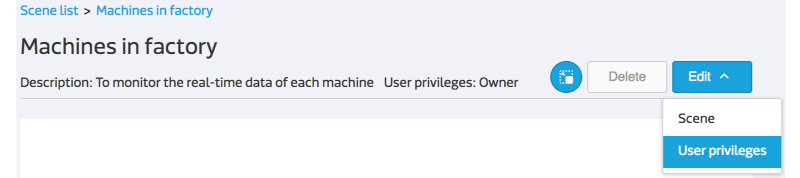

# 打造您專屬的場景圖

在本篇教學文章中，您將學會如何建立一個場景圖，並且將裝置、資料通道與網頁連結加入此場景圖當中，以方便後續的監控並落地到實際的工作場域中。

## 新增場景圖

在裝置詳情頁面中，您可以看到此裝置底下所有的資料通道以及通道的即時數據。但若想要同時監控多個裝置呢？此時，您可以透過場景圖來達到即時監控並操作多個裝置的需求。

操作步驟：

1. 點擊網站上方導覽列中的 **場景** 前往場景列表頁面。

2. 點擊列表下方的 **+ 新增場景**。
3. 輸入您自訂的 **場景名稱**、**描述** 並上傳 **圖片**，這裡的圖片就是場景的背景圖，也就是您工作場域的平面格局圖。
4. 當您按下 **下一步** 後，此場景已經新增完成。

5. 新增後，頁面會停留在 **場景編輯模式**，您可以在此編輯頁面繼續進行新增裝置等進階設定，完成後，點擊 **返回** 回到場景詳情頁面。

## 將裝置與資料通道加入場景圖中

您可以選取您有權限讀取的裝置並將其加到場景圖中，並選擇所要監控的資料通道。

操作步驟：

1. 您可以藉由以下兩個動作進入 **場景編輯模式**
	* 新增場景圖
	* 在場景詳情頁面點擊 **編輯** -> **場景**
	

2. 點擊左方操作面板的 **測試裝置** 或 **裝置** 按鈕。
3. 在下拉選單中選取您所要監控的裝置。
4. 您也可以自訂此裝置在場景圖上的顯示名稱，若不修改預設使用原本的裝置名稱。
5. **可顯示於場景的資料通道** 會顯示在下方的區塊，您可以按照您期望的顯示順序選取需要被監控的資料通道。**可顯示於場景的資料通道**包含：

	* 除了影像串流與圖片之外的所有顯示型資料通道。
	* 控制型的開關。

6. 點擊 **儲存** 後，您新增的裝置會出現在場景圖的左上角。

7. 可透過滑鼠長按裝置顯示區塊進行拖拉，將裝置擺放到想要的位置。
8. 在編輯模式中的修改會即時地被儲存，因此你可以隨時點擊**返回** 回到場景詳情頁面。
9. 隨後，您可透過 **編輯** 或 **刪除** 選單來調整裝置顯示區塊。

## 將網站連結加入場景圖中

操作步驟：

1. 在 **場景編輯模式** 點擊 **網址** 按鈕。
2. 輸入您自訂的 **顯示文字** 與 **網址連結**。請注意，網址連結的格式必須包含連接協定，例如：**http://**mcs.mediatek.com or **https://**mcs.mediatek.com
3. 隨後，您可透過 **編輯** 或 **刪除** 選單來調整網站連結。

## 將場景圖分享給其他 MCS 使用者

您可以針對某一個場景圖賦予其他 MCS 使用者 **管理者** 或 **一般檢視** 的權限，分享此場景圖，與之共同協作。但同時，您也必須手動將場景內的 **裝置權限** 賦予給此使用者，否則使用者將無法看到沒有權限的裝置。

操作步驟：

1. 點擊 **編輯** -> **使用者權限** 進入 **權限編輯模式**。

2. 點擊使用者列表下方的 **+ 新增使用者**。
3. 輸入您想分享的使用者在 MCS 註冊的 **Email** 帳號。
4. 選擇 **角色**。
5. 按下 **確定** 則完成所有設定。
6. 若您尚未將場景內的裝置權限開放給該名使用者，請務必在裝置詳情頁面 -> **使用者權限** 中補上對應的設定。

**場景的使用者權限**

| 角色 | 觀看場景 | 變更場景設定 | 刪除場景| 設定權限 |
|:---:|:---:|:---:|:---:|:---:|
|**管理者**|可|可|否|可|
|**一般檢視**|可|否|否|可|

## 觀看場景並監控裝置

在場景列表中，您可以看到您有權限讀取的所有場景。點擊場景名稱，則可進入場景詳情頁面。在此，您可以觀看並控制你工作場域中的所有裝置，其功能包括：

1. 觀看所選裝置的即時數據。
2. 觀看所選裝置的連線狀態。
3. 操作控制型開關。
4. 透過點擊裝置名稱，訪問裝置詳情頁面。
5. 透過點擊網站連結，訪問自定義的網站頁面。

