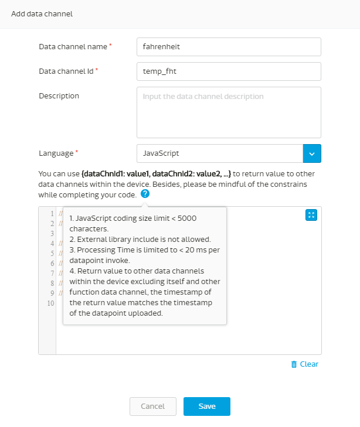
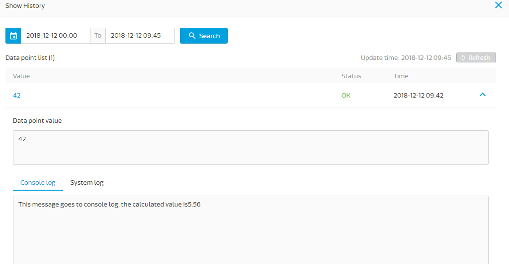

#資料運算通道教學

資料運算通道允許您在資料點上傳到此通道時執行您自己的JavaScript程式碼段，允許程式碼段對此資料點執行簡單計算，並能夠將處理後的值傳遞到同一裝置中的其他資料通道。此功能使物聯網設備開發人員能夠將一些裝置上的運算委任給MCS資料運算通道，對以下使用場景也許會有幫助：

1.為電池供電的物聯網設備節省電量
2.對IoT設備收集的不同傳感器資料執行自定義計算。
3.對MCS資料運算通道上的程式碼更新部分取代FOTA更新到裝置的功能。

以下是一個簡單教學，說明了一個採用華氏溫度傳感器值的資料通道，利用資料運算通道轉換為攝氏溫度並將該值轉發到另一個資料通道：

##定義資料運算通道

建立原型後，通過單擊“新增”按鈕，您可以通過單擊左下角圖標添加功資料運算通道：


在“新增資料運算通道”表單中，您可以填寫資料運算通道名稱和資料運算通道ID，如螢幕截圖所示，下半部分是程式碼編輯區域，您可以通過單擊藍色方塊圖標將其展開到全螢幕右手邊。


表單的中間部分有一個描述，描述如何將計算值返回到同一設備中的其他資料通道。通過點擊問號，您將看到使用此程式碼的使用限制



將JavaScript程式碼附加到程式碼編輯區中，然後單擊“儲存”


以下是本教學的程式碼：

```
//Use context.value to get uploaded data point.
//Following is an example of temperature conversion:

var fahrenheit = context.value;
var celsius = Math.round(((fahrenheit - 32) / 1.8)*100,2)/100;
console.log("This message goes to console log, the calculated value is" + celsius);
 return {
  temp_dgc: celsius
   };
```
請注意：

1.	上傳到此資料通道的資料點可以第1行中的contex.value來做引用
2.	第2行是計算華氏溫度到攝氏溫度
3.您可以在第6行中輸出到控制台日誌作為示例
4.將攝氏溫度轉發到temp_dgc資料通道

##建立浮點數數值行資料通道和建立測試裝置

儲存後，您還應建立一個浮動數數值型資料通道，資料通道ID分別為temp_dgc，如下所示：


完成後，原型應該有兩個資料通道，如下所示：


然後，您將從該原型中建立一個測試裝置進行測試。

##上傳資料點進行測試

現在讓我們使用POSTMAN將資料點上傳到資料運算通道，如下所示：


您將觀察到一個值“42”到達至資料運算通道，下面帶有“最後一個資料點狀態：OK”，表明該資料點已成功處理。 Celsius資料通道中的值顯示為“5.56”，同時確保程式碼已執行且返回值成功。
如果某個程式碼未成功執行，將顯示“FAILED”訊息。


您可以單點資料通道右上角，然後單擊“顯示歷史記錄”以查看此資料點處理過程的詳細信息：

 

您將看到顯示值為“42”的列表，點擊右側的向下箭頭以展開詳細信息，您可以在其中看到控制台日誌選項，其中顯示在程式碼的第6行中組成的信息。如果在程式碼執行期間生產生系統相關的錯誤消息，系統日誌將顯示在系統日誌選項中。



以上是使用資料運算通道的簡單教學。

