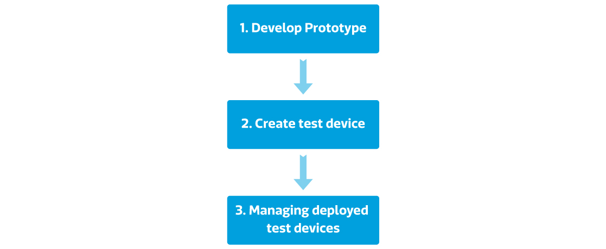

# 上手指南

透過以下的四個步驟，您能快速使用MediaTek Cloud Sandbox開發您的物聯網專案:

1. 開發產品原型
2. 創建測試裝置
3. 管理已部署的測試裝置
4. 配置您的用戶設定

[開發產品原型]

The developer develop a prototype by first create a prototype in the Development console. A prototype may have several data channels which take different datapoint types.

[Create Test Device]

AFter creating a prototype, the developer can create a test device to test and control his device. The developer can also use the my device console to visually view the simulated result for his prototype or to control the devices.

[Managing deployed test devices]

The developer can monitor all the test devices under each prototype in the Development console, the developer can also view all the test device in the My device console which he has the access for.

In the future, when the prototype is release to the end user, the end user can manage and configure the device in the My device console as well to view the data, set notification, and share the device to other users.

[Manage your profile]

You can always change the setting of your user profile by clicking on your name on the upper right panel, and click Profile. You can change the password for your account and change the timezone by selecting your current country. All your prototypes and test devices will use the tomezone you have set here.

