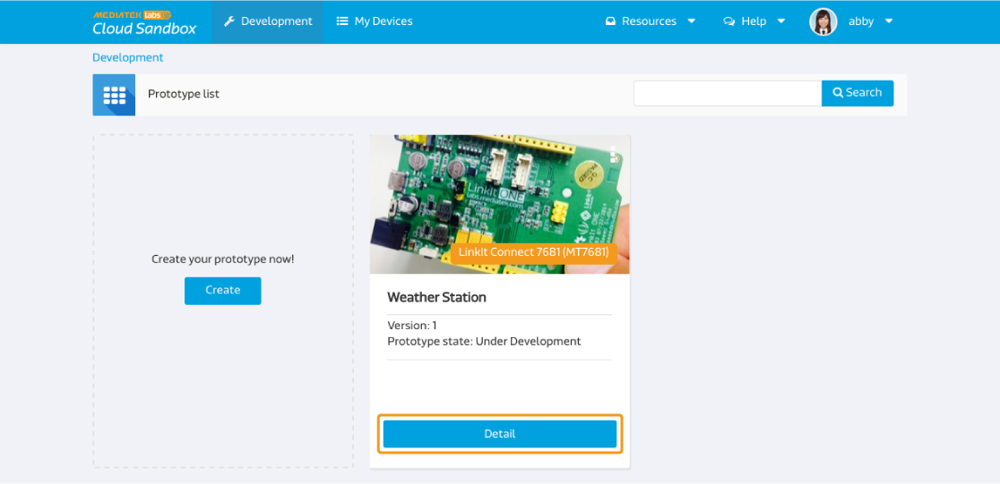
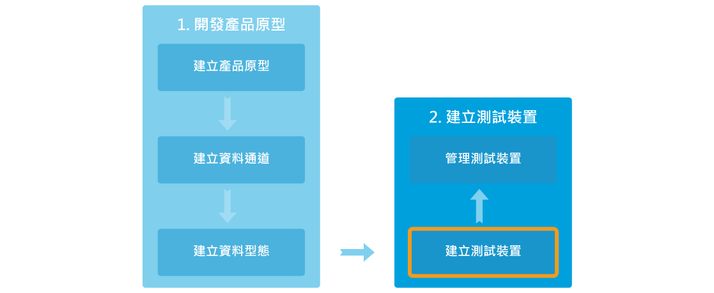
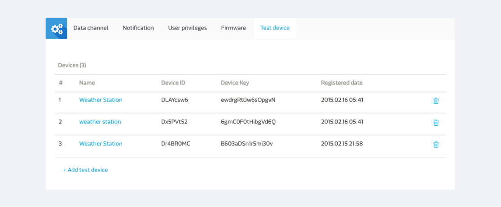
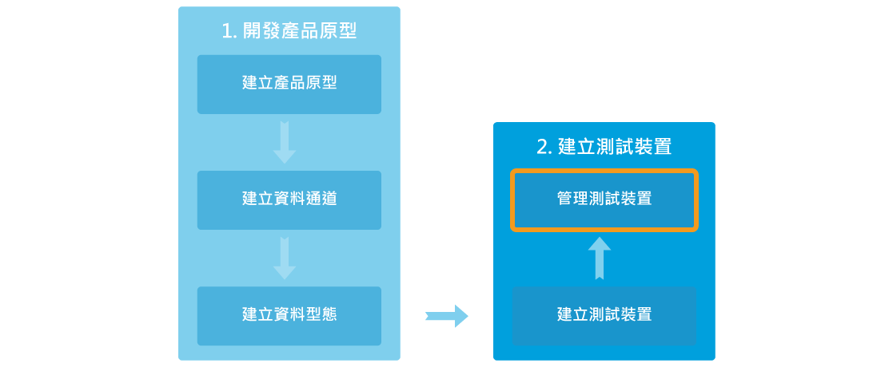

# 上手指南

透過以下的四個步驟，您能快速使用 MediaTek Cloud Sandbox 開發您的物聯網專案:

1. 開發產品原型
2. 創建測試裝置
3. 管理已部署的測試裝置
4. 配置您的用戶設定

[開發產品原型]

開發者能在**開發**頁面建立產品原型。產品原型內，會包括多個能傳替各種形態資料的資料通道。

[建立測試裝置]

當建立好產品原型後，開發者能建立測試裝置來和實際裝置連結。開發者亦可以在**我的裝置**頁面瀏覽所有的測試裝置狀態，並且對裝置下達指令。

[管理已部屬的裝置]

開發者能夠在**開發**頁面中的測試裝置分頁看到所有在特定產品原型下的測試裝置。開發者亦可在**我的裝置**頁面中看到所有由他所建立的或是有訪問權限的裝置。

將來，當您的產品原型商轉後，消費者亦能登入平台，在**我的裝置**頁面中查看所以關於他的裝置的設定和狀態，例如查看裝置蒐集的資料，設定通知，或是分享給其他使用者。

[配置您的用戶設定]

您可以點擊畫面右上角您的名字的用戶設定來更改您的帳戶設置。您可以為您的帳戶更改密碼，並選擇您當前的國家改變時區。所有的產品原型和測試設備將會套用您在此處的時區設置。

# 建立您的第一個產品原型

## 建立產品原型逐步導引

步驟一，點擊畫面上方的開發連結。

步驟二，點擊創建按鈕。

步驟三，輸入產品原型名稱，版本，並選擇硬體平台，產業，之後點擊儲存按鈕。
您的產品原型已建立。

步驟四，點擊您剛建立的產品原型內的詳情按鈕。

當您建立好產品原型後，您可以開始建立資料通到，通知，設定使用者權限，並且新增測試裝置了。

步驟五，點擊新增資料通道分頁中的新增按鈕。

步驟六，選擇資料通道型態。例如控制器，顯示器，或是綜合型控制顯示器。之後點選新增按鈕。

步驟七，輸入資料通道名稱，資料通道 ID，描述，並選擇資料型態。

步驟八，點擊儲存按鈕。您的資料通道已建立。您可以在資料通道名稱下方查看您的 data channel Id 。您將會在未來呼叫測試裝置取得資料或是下達指令時，需要此資訊。

如果您需要了解更多關於資料通道或是資料型態的詳細信息，您可以參考資源中的核心概念章節。

# 創建您的第一個測試裝置

## 創建測試裝置逐步導引

[事前準備] 您必須先完成開發產品原型

步驟一，點選產品原型的詳情按鈕。

步驟二，點選畫面上方的創建測試裝置按鈕。

步驟三，在跳出來的創建測試裝置對話窗中，輸入測試裝置名稱和描述，然後點擊確定按鈕。

步驟四，您將會看到創建成功的訊息。您可以直接點擊詳細資料按鈕連
接至測試裝置詳情頁面。

步驟五，您亦可於產品原型頁面中的**測試裝置**分頁內查看屬於此產品原型的測試裝置。

請注意，您測試裝置中所有的資料通道都是由產品原型繼承而來的。如果您在產品原型中更新了資料通道，此更新亦會同時反應至所有屬於此產品原型的測試裝置。

## 如何取得裝置的 DeviceId 和 DeviceKey

當您創建好測試裝置後，您可以查看或是控制您的裝置來確保在正式商轉前產品的功能穩定性。

您能夠在兩個地方找到測試裝置的 DeviceId 和 DeviceKey：

1. 產品原型頁面中的**測試裝置**分頁。
2. 測試裝置詳細資料頁面中。

測試裝置的 DeviceId 和 DeviceKey 是用來呼叫API時必須使用到的參數。在**測試裝置**詳情頁面中，您會看到藍色字體的 DeviceId 和 DeviceKey 編號，單擊右方的複製按鈕，將會立即複製至您的剪貼布。

此外，您亦會需要 data channel Id 當您欲存取特定測試裝置中的資料通道值。您可以在**測試裝置**詳情頁面中，查看每個資料通道的 data channel Id 。請注意，一旦測試裝置已連接並開始傳送資料，此 data channel Id 將會被最後更新的資料點時間取代。

# 管理已部署的測試裝置

## 如何管理已部署的測試裝置

您可以在產品原型頁面的**測試裝置**分頁，或是**我的裝置**頁面中查看和管理您所有的測試裝置。將來，當您的產品原型商轉後，消費者亦能登入平台，在**我的裝置**頁面中查看所以關於他的裝置的設定和狀態。

### 從開發者的觀點

如果您是開發者，您可在**開發**或是**我的裝置**頁面做以下操作：

1.  開發或是查看資料通道
2.  設定通知
3.  設定使用者權限
4.  管理韌體和對任體做更新
5.  管理測試裝置

### 從使用者觀點

將來，當您的產品原型商轉後，消費者亦能登入平台，在**我的裝置**頁面中查看所以關於他的裝置的設定和狀態。

如果您是使用者，您可在**我的裝置**頁面做以下操作：

1.  查看資料通道
2.  設定通知
3.  設定使用者權限
4.  更新韌體

# 配置您的用戶設定

用戶可以通過點擊畫面右上方自己的名字來編輯修改您的用戶配置文件。

用戶也可以在這裡更改您的密碼和時區。

您裝置內的資料通道的時間序列圖將根據你的時區設置。

