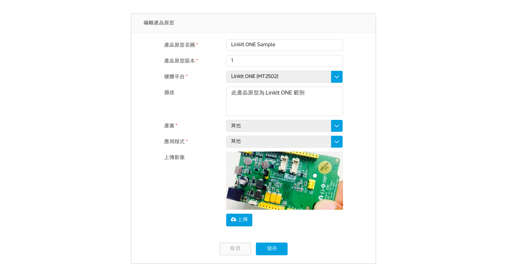
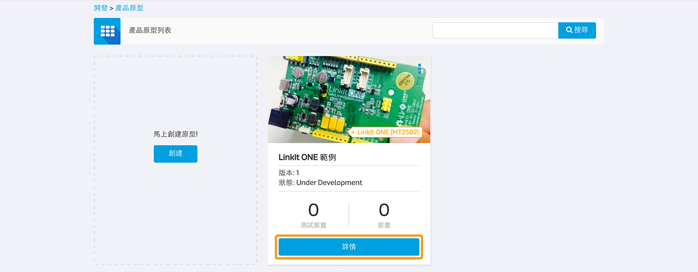
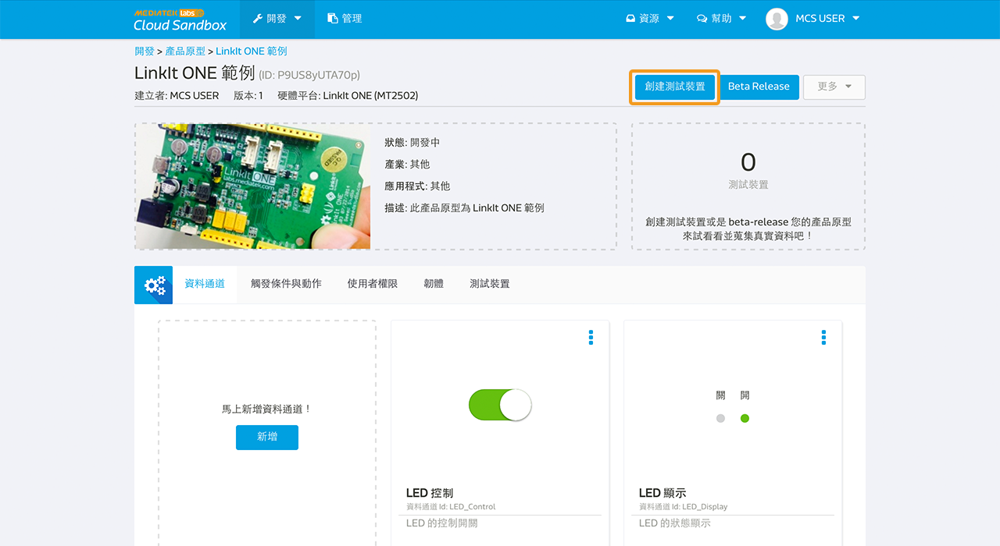
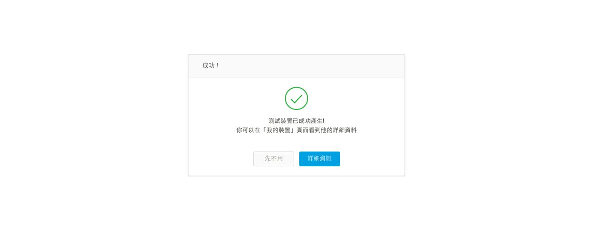

# 使用 LinkIt ONE 開發板實現類比控制器

下面是一個簡單的指南來快速設置您的 LinkIt ONE 開發板（Aster 2502 ）在 MediaTek Cloud Sandbox 上，做類比控制器之應用 。

## 情境

此教程的情境為，替您的 LinkIt ONE 開發板建立一個測試裝置，替您的板子上傳一段 Arduino code，且使用 RESTful API 來控制您位於開發板上 ~D3 的 LED 燈光亮度。

## 設置準備

為了要完成此設置，您必須先：

1. 您的開發板必須有電源連接，電源可來自電池或是 micro-USB。
2. 您的開發板必須有 Wifi 連結。

此外，您不需要額外的電子組件，就可以連接到開發板了。

### 步驟一　替您的產品原型新增一個類比控制器資料通道

a. 登入平台後，點選上方開發之下的"產品原型"，並且點擊新增按鈕，來新增一個新的產品原型。您亦可直接匯入此[範例產品原型](http://cdn.mediatek.com/tutorial/LinkIt_ONE/LinkIt_ONE_analog_TW.json)，若您選擇直接匯入產品原型，您可以跳過步驟一，直接從步驟二開始。

b. 請跟著畫面指示填入產品原型的基本資訊：

c. 點擊您剛建立的產品原型下方的"詳情"按鈕

d. 在產品原型詳情頁面中，點擊"資料通道"分頁，並且點擊新增按鈕來新增一個資料通道：

在此教程中，我們需要建立一個資料通道用來對開發版上的 LED 亮度發出調整控制訊號。

e. 點擊在"控制器"下方的新增按鈕，並輸入以下資訊：

 請注意，您在此輸入的資料通道 Id 是獨特不可重複的，之後將會在呼叫 API 時使用到。

### 步驟二　建立測試裝置

a. 點擊畫面右上方的"創建測試裝置"

b. 輸入測試裝置名稱和描述：

c. 測試裝置建立後，點擊"詳細資訊"連結至測試裝置詳情頁面:

請注意，deviceId 和 deviceKey 是獨特不可重複的，之後將會在呼叫 API 時使用到。

### 步驟三　取得DeviceId，DeviceKey，以及資料通道 ID

下方的摘要訊息為我們與測試裝置溝通時所需要的必要欄位：

| 名稱 | 值 | 備註 |
| -- | -- | -- |
| deviceId | Dsre1qRQ | 測試裝置的獨特識別碼 |
| deviceKey | DFbtsNWg4AuLZ30v  | 測試裝置的 API Key |
| dataChannelId | analogTest | 此教程中所需控制器類型 LED 燈量度的資料通道代碼 |

注意一：此教程中圖片所顯示的 deviceId 和 deviceKey 會和您實際操作時取得的不一樣，請使用您所取得的值。

注意二：deviceId 的大小寫是不一樣的，請保持和上方表格資料值相同的大小寫。

### 步驟四　替您的開發板編程

操作流程如下：

a. 呼叫 RESTful API：
GET api.mediatek.com/mcs/v2/devices/{deviceId}/connections.csv
來取得 Socket Server IP 和連接阜的值。

b. 和 Socket server 建立 TCP connection

c. 呼叫 RESTful API:
POST api.mediatek.com/mcs/v2/devices/{deviceId}/datapoints.csv
每五秒上傳一次位於開發板 ~D3 位置的 LED 燈狀態

請注意：當您使用 Analog 和 PWM 類型之資料通道，您需要使用在 LinkIt ONE 開發板上帶有 ~ 開頭之腳位。例如本教程中所使用之 ~D3 腳位。

d. 並且保持 TCP connection 連線隨時可以接收來自 MCS 的指令

e. 每 90 秒更新一次 TCP connection 的 heartbeat 連線

請點擊此連結來下載 Arduino 範例程式 [here](https://raw.githubusercontent.com/Mediatek-Cloud/MCS/master/source_code/AnalogLinkItOneSample)

請注意:
使用此範例程式需要 HttpClient，您可使用此連結下載
[here](https://github.com/amcewen/HttpClient/releases)

f. 替您的 LinkIt ONE 開發板外接以下電路板及元件：

### 步驟五　讓您的開發板開始動作吧！

當您將範例程式上傳至開發板後，請確保開發板有 Wifi 網路連線，並且有定時傳送訊號顯示裝置已連接並正在待命中：

現在您已可至裝置詳情頁面中，透過類比控制器資料通道來控制您的 LED 燈號亮度。當您將控制器調至 255 時，LED 燈亮度將會開到最大。當您將控制器調至 100 時，LED 燈還會是亮的，但是亮度降低。當您將控制器調至 0 時，LED 燈則會關閉。

恭喜！您已完成此教程！
