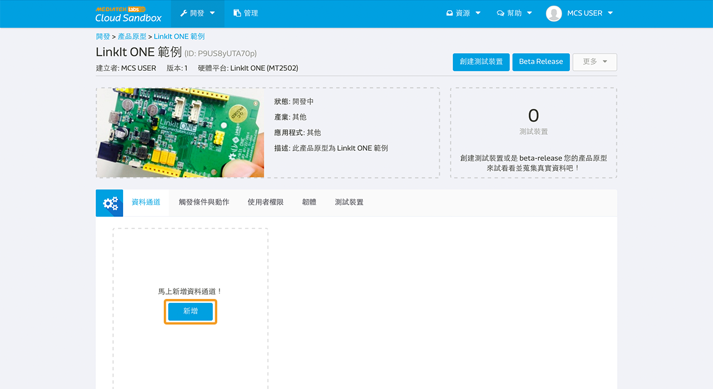
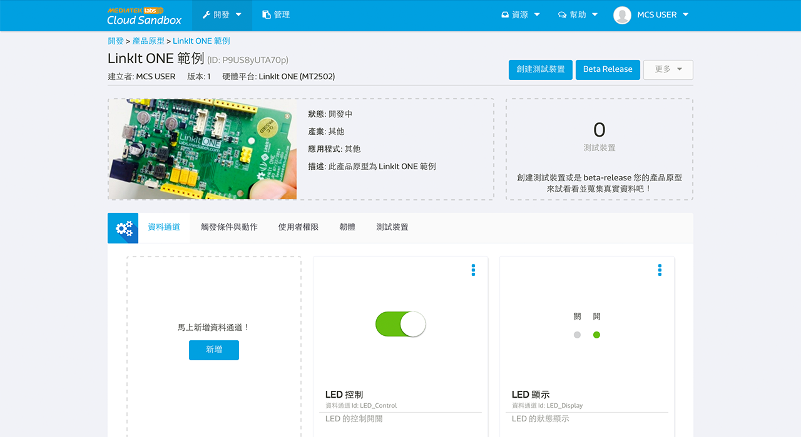
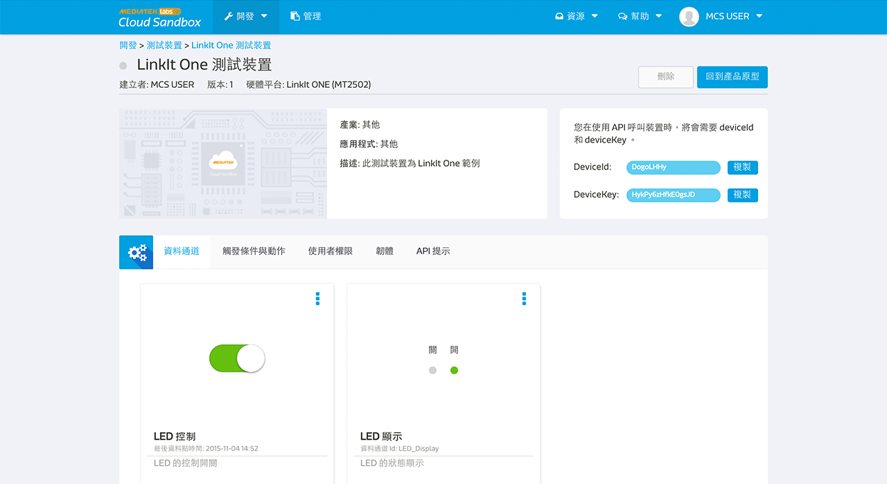

# LinkIt ONE 實際操作

下面是一個簡單的指南來快速設置您的 LinkIt ONE 開發板（Aster 2502 ）連接到 MediaTek Cloud Sandbox。

## 情境

此教程的情境為，替您的 LinkIt ONE 開發板建立一個測試裝置，替您的板子上傳一段 Arduino code，且使用 RESTful API 來使您的開發板能上傳位於 D13 的 LED 燈光狀態至 MCS，同時也可以使用 MCS 透過 TCP Socket 來遠程控制 LED 狀態。

## 設置準備

為了要完成此設置，您必須先：

1. 您的開發板必須有電源連接，電源可來自電池或是 micro-USB。
2. 您的開發板必須有 Wifi 連結。

此外，您不需要額外的電子組件，就可以連接到開發板了。

### 步驟一　替您的產品原型新增一個開關類型的資料通道

a. 登入平台後，點選上方的"開發"，並且點擊新增按鈕，來新增一個新的產品原型。

b. 請跟著畫面指示填入產品原型的基本資訊：

c. 點擊您剛建立的產品原型下方的"詳情"按鈕

d. 在產品原型詳情頁面中，點擊"資料通道"分頁，並且點擊新增按鈕來新增一個資料通道：

在此教程中，我們需要建立兩格資料通道，一個是顯示器類型的，用來表示開發板上 LED 燈光的狀態；另一個則為控制類型的，用來對您的開發板 LED 燈光狀態下指令:

e. 點擊在"顯示器"下方的新增按鈕，並輸入已下資訊：

請注意，您在此輸入的資料通道 Id 是獨特不可重複的，之後將會在呼叫 API 時使用到。

f. 重複步驟 e，但是把顯示器改成"控制器"，並且輸入以下資訊：

請注意，您在此輸入的資料通道 Id 是獨特不可重複的，之後將會在呼叫 API 時使用到。

g. 完成後，您將會有以下的資料通道：

### 步驟二　建立測試裝置

a. 點擊畫面右上方的"創建測試裝置"

b. 輸入測試裝置名稱和描述：

c. 測試裝置建立後，點擊"詳細資訊"連結至測試裝置詳情頁面:

請注意，deviceId 和 deviceKey 是獨特不可重複的，之後將會在呼叫 API 時使用到。

### 步驟三　取得DeviceId，DeviceKey，以及資料通道 ID

下方的摘要訊息為我們與測試裝置溝通時所需要的必要欄位：

| 名稱 | 值 | 備註 |
| -- | -- | -- |
| deviceId | Dsre1qRQ | 測試裝置的獨特識別碼 |
| deviceKey | DFbtsNWg4AuLZ30v  | 測試裝置的 API Key |
| dataChannelId | LED | 此教程中所需顯示器類型 LED 燈號的資料通道識別碼 |
| dataChannelId | LED_CONTROL | 此教程中所需控制器類型 LED 燈號的資料通道識別碼 |

請注意，此教程中圖片所顯示的 deviceId 和 deviceKey 會和您實際操作時取得的不一樣，請使用您所取得的值。

### 步驟四　替您的開發板編程

操作流程如下：

a. 呼叫 RESTful API：
GET api.mediatek.com/mcs/v2/devices/{deviceId}/connections.csv
來取得 Socket Server IP 和連接阜的值。

b. 和 Socket server 建立 TCP connection

c. 呼叫 RESTful API:
POST api.mediatek.com/mcs/v2/devices/{deviceId}/datapoints.csv
每五秒上傳一次位於開發板 D13 位置的 LED 燈狀態

d. 並且保持 TCP connection 連線隨時可以接收來自 MCS 的指令

e. 每 90 秒更新一次 TCP connection 的 heartbeat 連線

請點擊此連結來下載 Arduino 範例程式 [here](https://raw.githubusercontent.com/Mediatek-Cloud/MCS/master/source_code/linkit_sample_ino.ino)

請注意:
使用此範例程式需要 HttpClient，您可使用此連結下載
[here](https://github.com/amcewen/HttpClient/releases)

### 步驟五　讓您的開發板開始動作吧！

當您將範例程式上傳至開發板後，請確保開發板有 Wifi 網路連線，並且有定時傳送訊號顯示裝置已連接並正在待命中：

您現在可以去裝置詳情頁面，並看到您剛建立的 LED 控制器，當您將控制器狀態設成開，開發板上的 LED 燈即會打開，同時，您將可以看到您所建立的 LED 顯示器的狀態也改變為開了。反之亦然，若控制技設為關，燈即會關閉，並顯示器狀態改為關。

恭喜！您已完成此教程！

