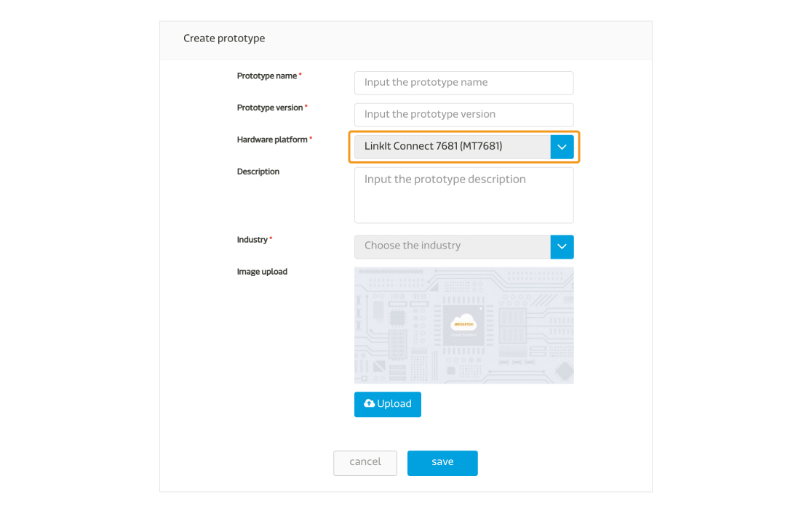
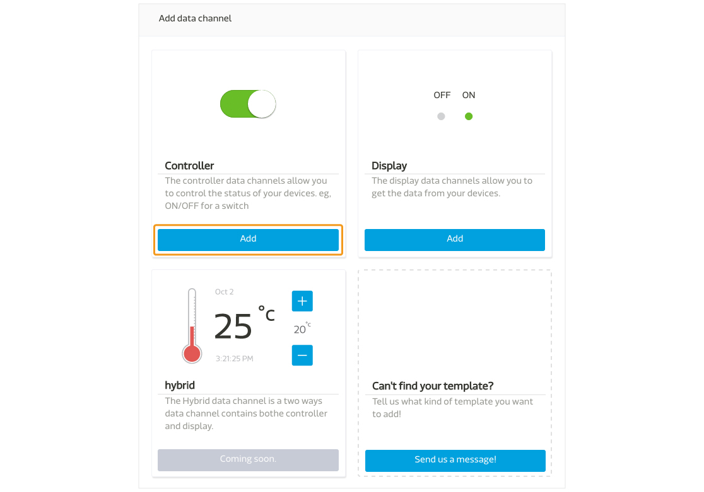
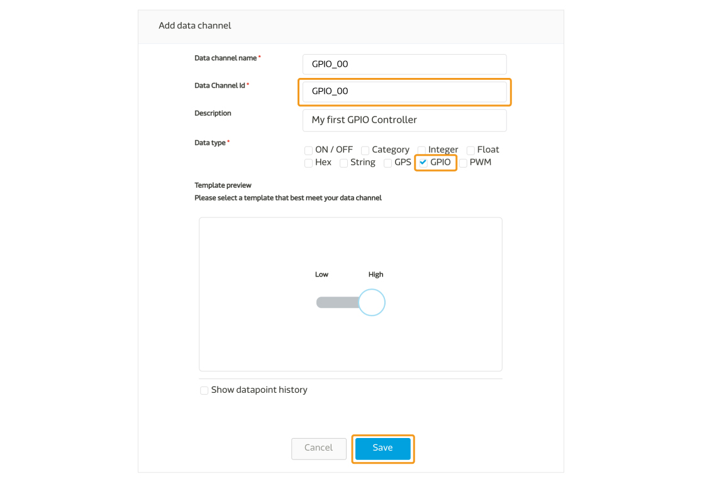
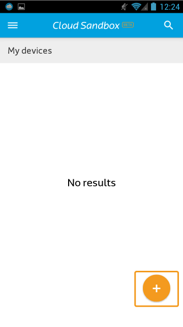
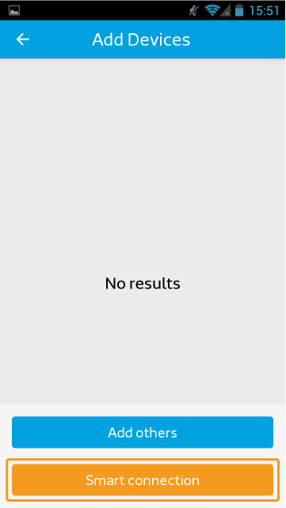
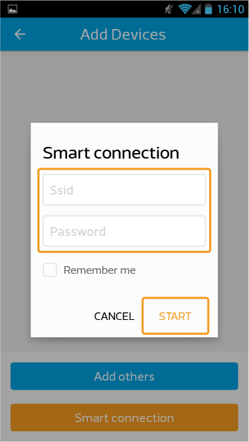
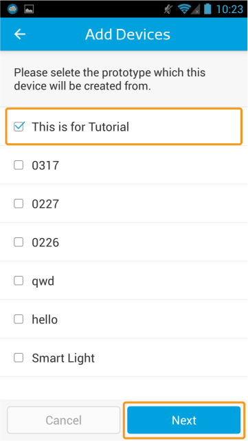
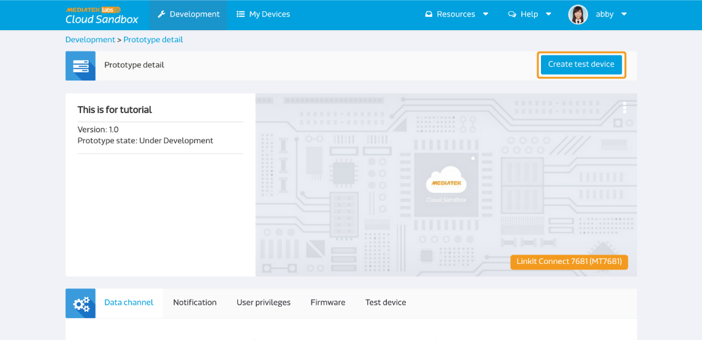
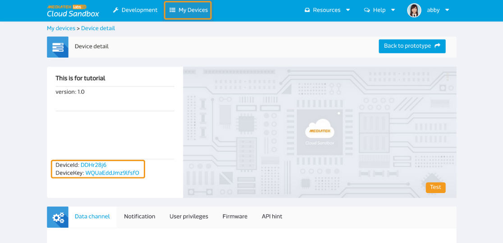
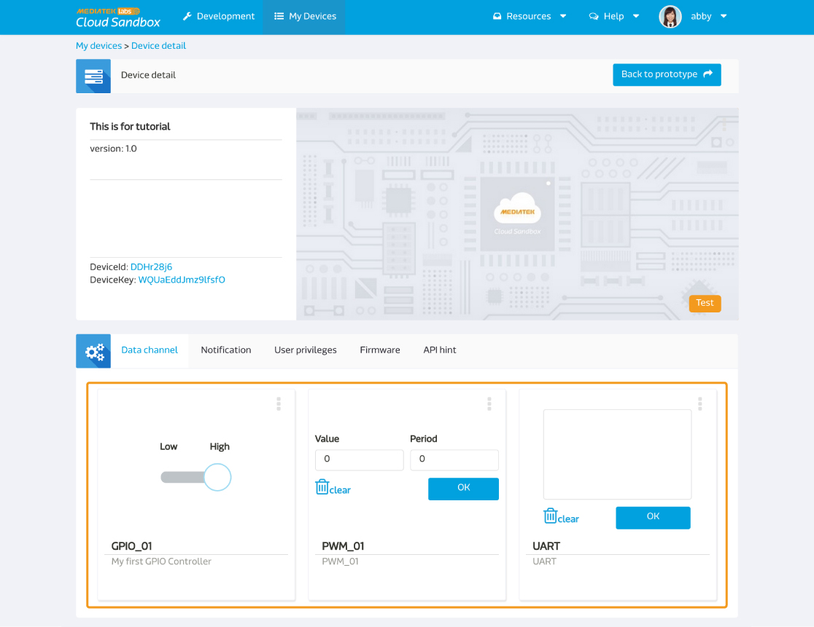

# LinkIt Connect 7681 實際操作

下面是一個簡單的指南來快速設置您的LinkIt Connect 7681 開發板（MT 7681 ）連接到MediaTek Cloud Sandbox。

## 情境

此教程的情境為，將您的LinkIt Connect 7681開發板與MCS平台相連，並可從MCS網頁端或手機端接收或傳送指令。


## 設置準備

為了要完成此設置，您必須先：

1. 您的開發板必須有micro-USB電源連接。
2. 您的開發板必須有Wifi連結。
3. MCS 手機應用程式。此程是目前只支援安卓(Android)系統。請使用此QR code下載最新的手機安裝檔：


此外，您不需要額外的電子組件，就可以連接到開發板了。

## MT7681　控制器清單以及相對的MCS資料通道ID

MT7681晶片組提供了五組GPIO針腳，您亦可使用PWM資料型態和一組UART阜。以下是MT7681的針腳和對應的資料通道ID。

|  | GPIO | PWM | UART |
| -- | -- | -- | -- |
| 00 | GPIO_00 | PWM_00 | UART |
| 01 | GPIO_01 | PWM_01 |
| 02 | GPIO_02 | PWM_02 |
| 03 | GPIO_03 | PWM_03 |
| 04 | GPIO_04 | PWM_04 |


## 逐步指引

### 步驟一　建立有GPIO，PWM，以及UART資料通道的產品原型。

a. 點擊畫面上方的 **開發**

b. 在產品原型清單頁面中，點擊**創建**按鈕來新增一個新的產品原型。


c. 輸入產品原型名稱，版本，並選擇產業別。硬體平台請選擇**MT7681**，之後點擊儲存案。您的產品原型已建立。




d. 現在您已準備好替您的產品原型新增一組控制器類型的GPIO資料通道了。點擊您剛新建好的產品原型下方的**詳情**按鈕。


e. 點擊**資料通道分頁**，並點擊**新增**按鈕。


f. 請點擊**控制器**下方的**新增**按鈕來新增一個控制器類型的資料通道。




g. MT7681類型的產品原型，資料通道ID的格是如以下定義 - GPIO_nn, nn代表從00開始的腳號。替第一個腳號建立資料通道，您可使用"GPIO_00"。輸入資料通道名稱(GPIO_00)(GPIO_00)，輸入描述，並且選擇**GPIO**資料型態。點擊**儲存**來新增您的資料通道。




h. 增加更多的GPIO腳號控制器，重複步驟e，f，和g。並注意需使用正確的資料通道ID(GPIO_01 to GPIO_04)。

i. 現在您已經準備好控制器類型的PWM資料通道。重複步驟e和g來打開新增資料通道視窗。輸入"PWM_00"為您的資料通道ID，並選擇PWM為您的資料通道類型。點擊**儲存**來新增您的資料通道。


j. 增加更多的PWM腳號控制器，重複步驟i。並注意需使用正確的資料通道ID(PMW_01 to PMW_04)。

k. 另一個您需要替MT7681產品原型所新增的資料通道為UART。要新增UART資料通道，重複步驟e和f，新增一個控制器類型的資料通道。輸入資料通道名稱為"UART"並根據您的需求選擇**字串**或是**十六進位數**資料型態。點擊**儲存**來新增您的資料通道。


您現在已建立好所有LinkIt Connect 7681產品原型教程所支持的資料通道。請繼續至步驟二。


### 步驟二　將您的開發板連上無線網路

a. 使用手機打開MCS手機應用程式，使用您的帳號密碼登入。
Step 2.1 Open the MCS mobile app, sign in with your account and select the prototype you created in step 1.

b. 登入後，點擊畫面又下方的新增按鈕。



c. 點擊畫面下方的**Smart Connection**按鈕。此功能是使用MediaTek Smart Connection，如欲知更多細節，請參考ediaTek LinkIt Connect 7681開發者手冊。




d. 輸入無線網路的SSID和密碼，之後點擊**開始**。正常情況下，SSID會自動帶入您手機所連線至的無線網路。



e. 等待幾秒後，如果Smart Connection成功，您將會看到您的裝置在列表上。

點擊**取消**來退出Smart Connection 視窗。

現在，您可以透過MCS手機應用程式(步驟3A)，或是MCS網頁版(步驟3B)來註冊您的測試裝置。


###步驟3A　使用MCS手機應用程式來住測LinkIt Connect 7681 測試裝置

a. 打開MCS手機應用程式並登入。登入後，點擊畫面又下方的新增按鈕。


b. 如果您的裝置已透過無線網路Smart Connection成功，您可以在清單中看見您的實體裝置。點擊裝置右方的加號，來新增測試裝置。


c. 之後您將會看到產品原型列表。選擇您要新增測試裝置的產品原型，然後點擊**下一步**按鈕。



d. 輸入測試裝置名稱和描述，然後點擊**儲存**按鈕。


當測試裝置註冊後，您即可在測試裝置清單中看見您剛才所建立的測試裝置以及測試裝置內的資料通道。


### 步驟 3B　使用MCS網頁版建立測試裝置

a. 在MCS網頁版中，點擊畫面上方的**開發**，之後點擊您在步驟一所建立的產品原型的詳情按鈕來新增一個測試裝置。


b. 點擊畫面右上方的**創建測試裝置**按鈕。



c. 輸入**測試裝置名稱**和**描述**，之後點擊**確定**按鈕。您將會看到一個跳出視窗顯示您已成功建立測試裝置。點擊**詳細資訊**來查看測試裝置詳情。


d. 在測試裝置頁面中，您可以查看此測試裝置的deviceId和deviceKey。



e. 現在您可以手動將此測試裝置的deviceId寫入您的實體裝置。打開任意終端機，並輸入已下指令：

```
AT#FLASH -s0x180e9 -c[deviceId]
```
接下來，將deviceKey寫入您的實體裝置
```
AT#FLASH -s0x180f1 -c[deviceKey]
```

之後，輸入以下指令來註冊此裝置：
```
AT#FLASH -s0x18101 –v1
AT#FLASH -s0x18102 –v0
```
您的時體裝置已和MCS平台相連了。


### 步驟4A　透過手機應用程式來控制您的裝置

a. 打開MCS手機應用程式並登入。點擊您欲操作的測試裝置。


b. 您將會看到您在步驟一所建立的資料通道。將GPIO控制器狀態從低更改至高：您將會看到開發板上的LED燈打開。


### 步驟4B　透過MCS網頁版來控制裝置

a. 點擊網頁版上方的**我的裝置**，在您新增病註冊的裝置下方的，點擊**詳情**。


b. 您可以看到裝置內的資料通道，並可透過MCS傳送指令。您可以透過托拉控制器來更改裝置狀態。將GPIO控制器狀態從低更改至高：您將會看到開發板上的LED燈打開。




