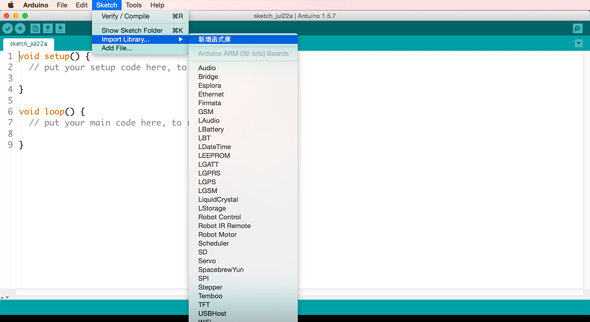
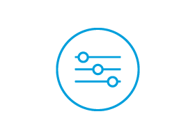

# LinkIt ONE 教程

在您準備好把範例程式碼放入您的 LinkIt ONE 開發板並連結至 MCS 雲端前，您需要確認您的開發環境與開發版是有正確設置的。

# 電腦開發環境與開發板設定

1. 下載 Arduino IDE 和 LinkIt ONE SDK

    [Mac](http://labs.mediatek.com/site/global/developer_tools/mediatek_linkit/get-started/mac/install/)

    [Windows]( http://labs.mediatek.com/site/global/developer_tools/mediatek_linkit/get-started/windows/install/)
2. 替您的LinkIt ONE 開發板更新韌體

    [Mac](http://labs.mediatek.com/site/global/developer_tools/mediatek_linkit/get-started/mac/update/)

    [Windows](http://labs.mediatek.com/site/global/developer_tools/mediatek_linkit/get-started/windows/update/)

3. 在您的 Arduino IDE 內設置好 SDK, 並透過正確的連接阜連上 Wi-Fi。

    [Mac](http://labs.mediatek.com/site/global/developer_tools/mediatek_linkit/get-started/mac/configure/)

    [Windows](http://labs.mediatek.com/site/global/developer_tools/mediatek_linkit/get-started/windows/configure/)

您亦可訪問此[連結](http://labs.mediatek.com/site/global/developer_tools/mediatek_linkit/get-started/index.gsp)來查看所有需要設置的步驟。 您可以在完成後，再度訪問我們的網站。或是直接透過以上的三個步驟也可完成。

**請注意：現有的 LinkIt ONE SDK 只能使用版本為 1.5.6-r2 BETA 或 1.5.7 BETA 的 Arduino IDE**。

# 增加 Libraries

現在，您的電腦與開發環境都已設置完成，我們準備將一些 library 也一起放入吧！以此教程來說，為一需要新增的 library 為 HttpClient，您可以在此[連結](https://github.com/amcewen/HttpClient/releases)下載。下載 zip 檔案，然後打開您的 Arduino IDE。

在 "Sketch" 下拉選單中，選擇匯入 library，並選擇您剛才所下載的 zip 檔案。

# MCS 雲端設定

就快完成了！現在您可以開始設定 MCS，並透過雲端來控制您的開發板。我們已經替您準備好所有所需的範例代碼和逐步導引。

現在，選擇您想要嘗試的範例吧：

| [基本的開關教程](../tutorial/implementing_using_linkit_one) | [類比控制器教程](../tutorial/implementing_analog_using_linkit_one) |
| -- | -- |
|||

