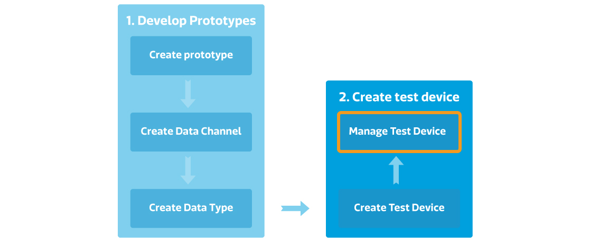

# 管理已部署的測試裝置

## 如何管理已部署的測試裝置

您可以在產品原型頁面的測試裝置分頁，或是我的裝置頁面中查看和管理您所有的測試裝置。將來，當您的產品原型商轉後，消費者亦能登入平台，在我的裝置頁面中查看所以關於他的裝置的設定和狀態。

### 從開發者的觀點

如果您是開發者，您可在開發或是我的裝置頁面做以下操作：

1.	開發或是查看資料通道
2.	設定通知
3.	設定使用者權限
4.	管理韌體和對任體做更新
5.	管理測試裝置

### 從只用者觀點

將來，當您的產品原型商轉後，消費者亦能登入平台，在我的裝置頁面中查看所以關於他的裝置的設定和狀態。。

如果您是開發者，您可在我的裝置頁面做以下操作：

1.	查看資料通道
2.	設定通知
3.　設定使用者權限
4.	更新韌體
