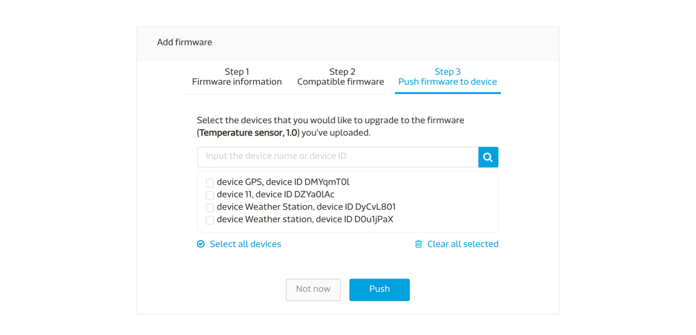
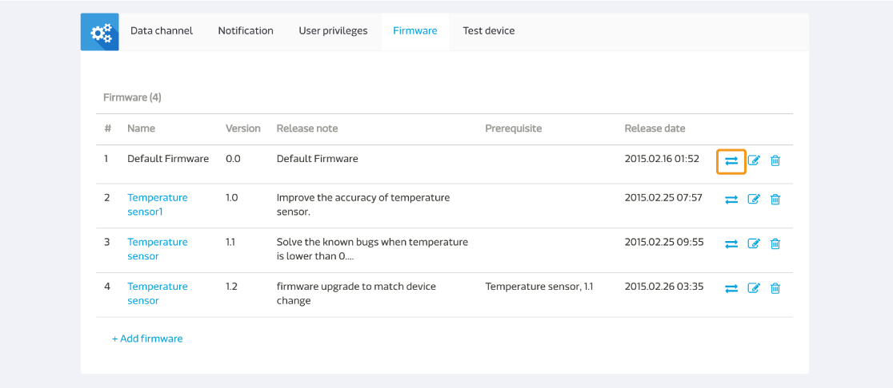
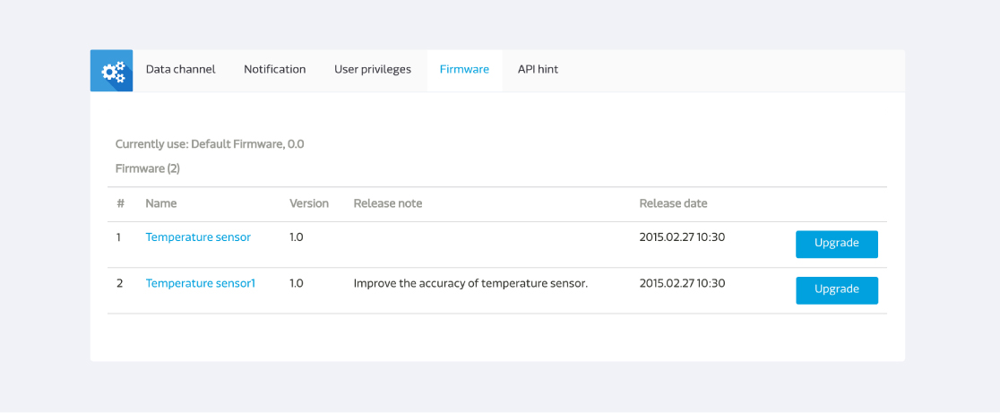

# 管理韌體

您可以使用MediaTek Clous Sandbox(MCS)來管理您的韌體，並且透過空中更新將韌體更新至您的裝置。

您可以在產品原型頁面中的**韌體分頁**來使用我們的韌體服務。點擊**新增韌體**來上傳一個新的韌體吧。

請輸入韌體名稱，版本，並且選擇您要上傳的韌體檔案，然後點擊上傳按鈕。

之後，選擇能相容此韌體更新的前置韌體。

當您在選擇能和此韌體更新相容的前置韌體時，您會發現，系統的預設值是所有的韌體都會被選取。您可以更改此設定，只要勾選您想要能相容的韌體即可。只有您在此勾選的前置韌體，能夠和您所上傳的新韌體相容。

如果您暫時不想將您所上傳的韌體更心直接更新置裝置，您可以點擊完成按鈕退出，或是您可以點擊下一步按鈕來選擇您要更新此韌體的裝置。

當您選取好要更心此韌體的裝置後，點擊推撥按鈕。您亦可以在韌體分頁中，點擊某一韌體的清單中右邊第一個圖標來做韌體推播。

您亦可以於裝置詳情頁面中來做韌體更新服務。您只需要再裝置詳情頁面中，點擊韌體分頁，您將會看到此裝置當時所使用的韌體，和您和此裝置目前韌體相容的其他韌體更新。

點擊您欲更新的韌體後方的**升級** 按鈕來更新。

