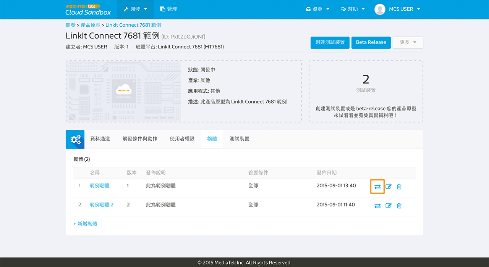

# 管理韌體

您可以使用 MediaTek Clous Sandbox (MCS) 來管理您的韌體，並且透過空中更新將韌體更新至您的裝置。

## 上傳韌體至產品原型

您可以在產品原型頁面中的**韌體分頁**來使用我們的韌體服務。點擊**新增韌體**來上傳一個新的韌體吧。

請輸入韌體名稱，版本，並且選擇您要上傳的韌體檔案，然後點擊上傳按鈕。

之後，選擇能相容此韌體更新的前置韌體。

當您在選擇能和此韌體更新相容的前置韌體時，您會發現，系統的預設值是所有的韌體都會被選取。您可以更改此設定，只要勾選您想要能相容的韌體即可。只有您在此勾選的前置韌體，能夠和您所上傳的新韌體相容。

如果您暫時不想將您所上傳的韌體更新直接更新置裝置，您可以點擊完成按鈕退出，或是您可以點擊下一步按鈕來選擇您要更新此韌體的裝置。

當您選取好要更新此韌體的裝置後，點擊推撥按鈕。您亦可以在韌體分頁中，點擊某一韌體的清單中右邊第一個圖標來做韌體推播。

## 替您的裝置更新韌體

您亦可以於裝置詳情頁面中來做韌體更新服務。您只需要在裝置詳情頁面中，點擊韌體分頁，您將會看到此裝置當時所使用的韌體，和您和此裝置目前韌體相容的其他韌體更新。

請注意，**推播**按鈕只有在此裝置有與 MCS 平台保持連線時才可以被點擊。您可以使用裝置名稱前方的燈號來判斷此裝置是否在線。當燈號為綠色時，表示裝置在線；當燈號為灰色時，表示裝置離線。

點擊您欲更新的韌體後方的**推播** 按鈕來更新。之後,您將會看到韌體推送成功訊息。

請注意, MCS 平台只會將韌體更新資訊傳遞到裝置端，我們將不會處理裝置端的韌體更新程序。您必須自行開發您的裝置，以下載和更新韌體。當您按下推播按鈕後，MCS command server 會將資訊以以下格式傳替給裝置：

**deviceId, deviceKey, timestamp, FOTA, version, MD5, URL**

* deviceId: 裝置的 deviceId
* deviceKey: 裝置的 deviceKey
* timestamp: 按下推播按鈕的時間點
* FOTA: 字串
* version: 被傳替的韌體版本
* MD5: 被傳替的韌體 MD5
* URL: 被傳替的韌體的下載網址

此外，若您是使用 7681 開發板，您將不必額外對開發板進行開發，我們已經內建韌體更新功能。您唯一需要注意的是確認韌體版本號有被正確設置，版本號需要為獨特不能重複的。此外，7681 裝置由於硬體限制，只能接受版本號高於現有版本的韌體更新。

## 使用 MCS APIs 來回報和更新韌體至 MCS 平台

MCS 提供多種韌體相關的 APIs 來讓您回報裝置目前使用之韌體，取得裝置所有可使用之韌體，和取得欲更新知韌體下載網址等等。唯一需要注意的是，您必須自行在您的裝置上開發以呼叫使用這些 API。

您可以使用**回報裝置韌體** [API](https://mcs.mediatek.com/resources/zh-TW/latest/api_references/) 來和 MCS 平台回報您目前使用的韌體版本。當裝置回報韌體版本後，您將可以在 MCS 平台中的韌體分頁中查看到此資訊。

若您不想透過 MCS 平台來查看或是更新韌體，您可以使用**取得裝置所有韌體資訊** [API](https://mcs.mediatek.com/resources/zh-TW/latest/api_references/) 以取得所有裝置可使用的韌體清單。

當您取得所有裝置可使用的韌體清單，並決定您要將裝置更新至特定韌體後，您可以使用**取得韌體 URL** [API](https://mcs.mediatek.com/resources/zh-TW/latest/api_references/) 來取得您欲更新的韌體位置資訊。

