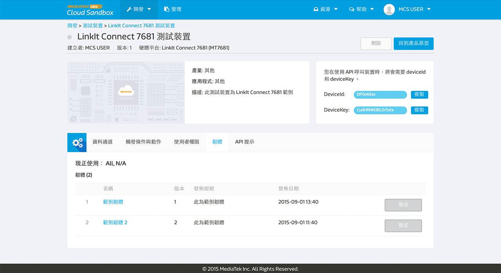

# 管理韌體

您可以使用 MediaTek Clous Sandbox (MCS) 來管理您的韌體，並且透過空中更新將韌體更新至您的裝置。

MCS 提供產品原型及其測試裝置的韌體上傳下載、版本與相容性管理服務。使用者可以選擇在網頁上直接推送韌體資訊至連線的裝置或是使用 MCS APIs 來讓裝置主動取得韌體資訊。

MCS 將不會處理裝置端的韌體更新，使用者需自行開發您的開發板來呼叫韌體相關 APIs 來下載和更新韌體。


## 上傳韌體

您可以在**產品原型**頁面中的**韌體**分頁來使用我們的韌體服務。點擊**新增韌體**來上傳一個新的韌體吧。


請輸入韌體名稱，版本，並且選擇您要上傳的韌體檔案，然後點擊上傳按鈕。


之後，選擇能相容此韌體的前版韌體。系統的預設值是所有韌體，您可以透過選擇**特定的韌體**並勾選能與此上傳版本相容的韌體修改其相容設定。只有正使用您所勾選的前版韌體的裝置，才能夠透過 MCS 網頁或 API 獲取此次上傳的韌體資訊，進行升級。

如果您不想立即將此新版韌體直接推送至連線中的裝置觸發更新，您可以點擊完成按鈕退出，或是您可以點擊下一步按鈕來選擇您要推送更新的裝置。


當您選取好欲推送韌體的裝置後，點擊推撥按鈕。


您亦可以在韌體分頁中，點擊某一韌體的清單中右邊第一個圖標開啟韌體推送頁面。


## 更新韌體

將韌體上傳至 MCS 主控台後，您可以透過 MCS 主控台頁面**推送**韌體資訊至連線中的裝置，或是透過 **MCS APIs** 取得與此裝置相容的韌體資訊。

若要在 MCS 主控台使用**韌體推送**功能，您可以在**產品原型 -> 韌體**分頁下點擊推送圖示並選取您所要推送至的裝置，或於單一裝置的**裝置詳情 -> 韌體**分頁下，選取欲推送的韌體並點擊推送按鈕。

請注意，**推送**按鈕只有在此裝置有與 MCS 平台保持連線時才可以被點擊。您可以透過裝置名稱前方的燈號來判斷此裝置是否在線。當燈號為綠色時，表示裝置在線；當燈號為灰色時，表示裝置離線。




推送完成後,您將會看到韌體推送成功訊息。


請注意, MCS 平台只負責將韌體更新資訊傳遞到裝置端，並不會處理裝置端的韌體更新程序。您必須自行開發您的裝置，完成後續韌體的下載與更新。

當您按下推送按鈕後，MCS 平台會將韌體資訊透過裝置與 MCS 平台連線的協定回傳給裝置，其格式如下：

1. TCP 連線：**deviceId,deviceKey,timestamp,FOTA,version,MD5,URL**，例如
	
	```
	Dbxxxx9k,TPJVxxxxxxxxBxBv,1513132150790,FOTA,2.0,null,https://cdn.mediatek.com/firmwares/P9MxxxxxxbTK/6a94dxxxxxxxxxxxxxxxxxxxx61f5df/a.bin
	```
2. MQTT 連線：**timestamp,FOTA,version,MD5,URL**，例如

	```
	1513133357160,FOTA,2.0,null,https://cdn.mediatek.com/firmwares/P9MxxxxxxbTK/6a94dxxxxxxxxxxxxxxxxxxxx61f5df/a.bin	
	```

欄位介紹：

* deviceId: 裝置的 deviceId（由於 MQTT 連線時，必須先指定 device ID，因此回傳訊息不包含此資訊）
* deviceKey: 裝置的 deviceKey（由於 MQTT 連線時，必須先指定 device key，因此回傳訊息不包含此資訊）
* timestamp: 按下推送按鈕的時間
* FOTA: 固定字串，表示韌體更新
* version: 韌體版本
* MD5: 韌體 MD5 雜湊，可用於檢查下載後的檔案是否完整。
* URL: 韌體的下載網址

若您是使用 LinkIt Connect 7681 開發板，您將不必額外對開發板進行開發，我們已經內建韌體更新功能。您唯一需要注意的是確認韌體版本號有被正確設置，版本號需要為獨特不能重複的。此外，7681 裝置由於硬體限制，只能接受版本號高於現有版本的韌體更新。


## 使用 MCS APIs

MCS 提供有以下幾個與韌體相關的 APIs ，方便您開發和管理裝置與韌體。

1. [回報裝置韌體 API](https://mcs.mediatek.com/resources/zh-TW/latest/api_references/#回報裝置韌體版本)：將裝置目前使用之韌體版本回報至 MCS 平台。請注意，您回報的韌體版本必須是已上傳至 MCS 平台的韌體版本。
2. [取得可用韌體 API](https://mcs.mediatek.com/resources/zh-TW/latest/api_references/#取得與此裝置相容的韌體列表)：若您已將裝置的韌體版本回報至 MCS 平台，您可以使用此 API 獲取相容的韌體資訊，包含韌體的下載網址。若您未曾回報裝置的韌體版本，其回傳的韌體資訊為無版本相容性限制的所有韌體資訊。

3. [取得與特定版本相容的韌體列表](https://mcs.mediatek.com/resources/zh-TW/latest/api_references/#取得與特定版本相容的韌體列表)：此 API 提供了一個更為彈性的方法取得與特定版本相容的韌體列表。您只需在 API 請求中指定要比較的版本號碼即可。

4. [取得韌體下載網址](https://mcs.mediatek.com/resources/zh-TW/latest/api_references/#取得韌體下載網址)：此 API 會回傳指定韌體的下載網址。