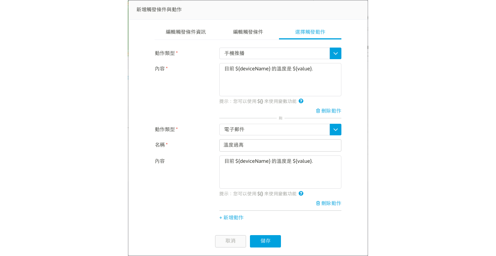

# 觸發條件與動作

您可以設定觸發條件和動作，當特定資料通道回傳的值符合您所設定的條件，系統將會發出通知提醒。 

以下是支援設定觸發條件的**資料通道**：

1. 開關
2. 分類
3. 字串
4. 十六進位值
5. 整數
6. 浮點數

並可套用以下的**條件**：

1. 大於
2. 小於
3. 等於
4. 介於～之間
5. 數值異動

當資料通道上傳的數值符合設定條件時時，會觸發通知動作。以下是四種支援的通知**動作**：

1. 電子郵件

	有權限能訪問這個裝置的使用者，皆能收到電子郵件通知，包括裝置的擁有者、管理者與一般檢視。
	
2. 手機推播

	您必須先安裝 MediaTek Cloud Sandbox 手機應用程式，並且登入 MCS 帳號。	
3. Webhook

	MCS 會發送一個 HTTP 請求到您指定的網址（Callback URL）。
		
4. 網頁警告
	
	當觸發條件成立時，在 MCS 網頁上會顯示相關的提醒，包含觸發的嚴重等級。
	

## 設定觸發條件與動作

您可以在**產品原型**頁面下設定**觸發條件與動作**，此觸發規則會套用在此原型下的所有裝置。隨後，您可以在各個**裝置**底下，修改條件的**觸發數值**。

操作步驟如下：

1. 當您點入產品原型頁面後，點選**觸發條件和動作**分頁 -> 點擊**新增觸發條件和動作**。

2. 在**新增觸發條件和動作**視窗中，填入必要的資訊。

	步驟一：**觸發條件名稱**之後將會顯示於**網頁警告**的訊息中。
	
	
	步驟二：您可設定多個比對條件，當這些**條件同時成立**時（**AND 邏輯**），則會觸發通知。請注意，要讓條件同時成立，您必須將此條件有用到的資料通道數值**同時上傳**到 MCS，意即寫在同個 HTTP 上傳的請求當中。
	
	
	步驟三：至少選擇一個**觸發動作**，當條件成立時，發送通知。本章後面會針對觸發動作有更詳細的介紹。
	

您在產品原型中設定的觸發條件和動作，會被產品原型下所有的測試裝置所繼承。在測試裝置中，您只能更改觸發條件的值或是選擇打開或是關閉此觸發條件和動作。

請注意，只有透過裝置上傳的資料點（上傳資料點時，在 HTTP 表頭帶有 	**deviceKey** 或是透過 **MQTT** 協定發布資料）才會觸發動作。使用者透過 MCS 網頁操作資料通道而產生的資料點將不會觸發。

## 觸發動作詳細介紹
### 設定手機推播

若使用者有多個手機裝置，MCS 能夠提供使用者設定是否每隻手機裝置都要收到手機推播通知。使用者能於兩個地方設定：

1. 在**個人檔案**頁面中，設定是否手機要收到**全部**來自 MCS 的推播通知。
2. 在**測試裝置**頁面中，設定是否手機要收到來自**特定測試裝置**的推播通知。

在**個人檔案**頁面中，您可以看到所有您有安裝 MCS 手機應用程式的手機列表。您可在此設定是否每隻手機要收到或不收到**全部**來自 MCS 的推播通知。

在**測試裝置**頁面中，展開**管理您的觸發動作**，您可以看到所有您有安裝 MCS 手機應用程式的手機列表。您可在此設定是否特定手機要收到或不收到**特定測試裝置**的推播通知。

### 設定 Webhook 

要使用 webhook 觸發動作，您只需要在設定觸發條件時，選擇 webhook 作為觸發動作，並且輸入您欲收到此觸發通知之網址。當觸發條件成立時，MCS 會發送一個 HTTP 請求到您提供的網址。

當您選擇 webhook 觸發動作後，您可以使用測試按鈕，來測試是否通知有被送出。送出之資訊包含 裝置名稱, device ID 和觸發值。

### 設定網頁警告

當您在觸發條件與動作中設定網頁警告時，也必須指定此警告的嚴重性等級。

當觸發條件成立，網頁警告訊息會立即出現在網頁上，並顯示**嚴重性等級**等資訊。網頁警告會出現在以下三個頁面：

1. 資料通道卡片 

	當資料通道的數值符合觸發條件，該資料通道上便會出現網頁警告標籤。展開後可看到更詳細的觸發資訊，包括**觸發條件名稱**與**警告發生時間**。在此範例中，此資料點是於 "2018-07-19 11:36" 上傳並觸發一個名叫 "Water is too hot" 的觸發條件。
	
	當你點擊**解除**之後，這個警告則會被解除不會顯示在網頁上，直到下次您的裝置在上傳符合此觸發條件的資料點。

	

2. 測試裝置列表

	在測試裝置列表中，**嚴重性最高**的警告會顯示在測試裝置的卡片上。
	
	以上面的範例來說，當測試裝置底下有兩個資料通道皆觸發了網頁警告，一個嚴重等級為 "High" 另一個為 "Medium"，則裝置卡片上的警告等級，會顯示 "High"。當 "High" 的警告解除後（可能是您按下了“解除”按鈕，或是重新上傳一個不符合觸發條件的資料點），則會顯示下一等級的警告 "Medium"。
	
	
	
3. 場景圖
	
	場景圖中，警告標籤的呈現方式與測試裝置列表ㄧ樣。

	

## 在通知內容中使用變數
MCS 預先定義了多個變數讓您可以在通知的名稱與內容欄位中使用，這些變數代表的是動作被觸發時，當下的真實數據。目前支援的變數包含有：

* **${deviceId}**: 設備的 ID
* **${deviceName}**: 設備的名稱
* **${value}**: 資料通道的數值

例如

您可將 Email 的內容設定成

	目前 ${deviceName} 的溫度是 ${value}.

當通知寄發給使用者時，其中的變數會被置換成當前的真實數據，像是

	目前 我的客廳 的溫度是 30.

