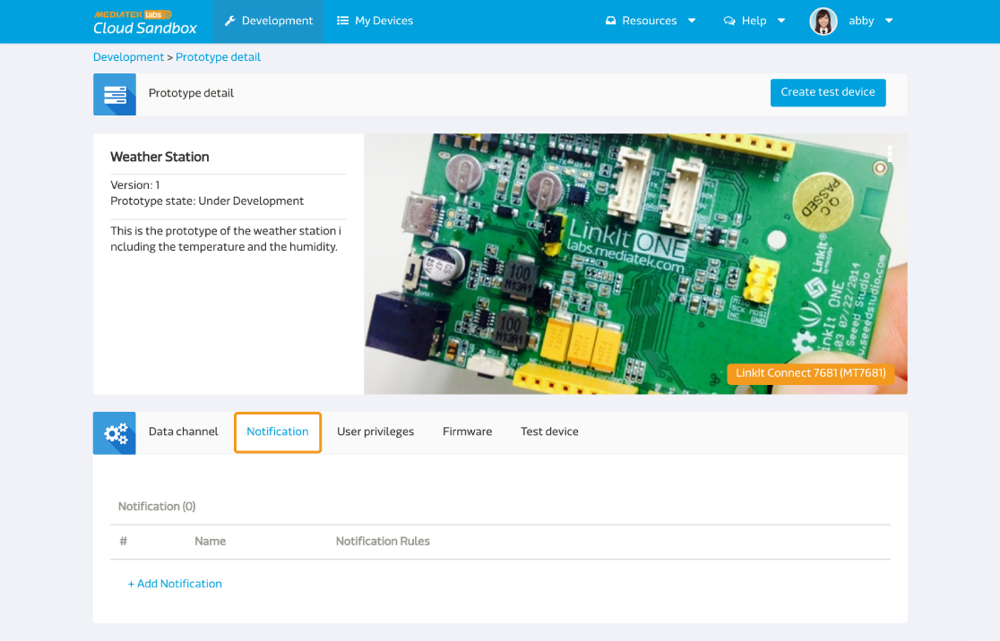

# 使用通知

您可以設定通知，當特定資料通道回傳的值超過您所設定的範圍時，系統將會發出電子郵件或是GCM通知。
請注意，目前MCS的通知只限定使用整數或是浮點數類型的資料型態。

當您點入產品原型頁面後，點選**通知分頁**。

點擊**新增通知**來新增您的通知,您能設定通知的名稱以及通知的條件,力如大於，小於，或是等於您所設定的值。

點擊新增按鈕來儲存。

您可以在同一個通知條件中，設定多個資料通道。此時，多個資料通道條件都要符合(且邏輯)，系統才會發出通知。若您想要單一條件符合(或邏輯)就收到通知，您就須設定多個通知條件。

您在產品原型中設定的通知條件，會被產品原型下所有的測試裝置所繼承。在測試裝置中，您無法更改通知的條件，所有條件變更，都必須回到產品原型設定中更改。
