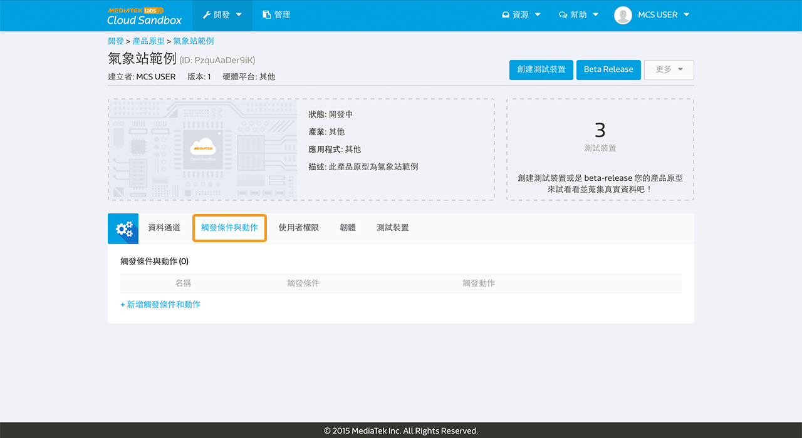
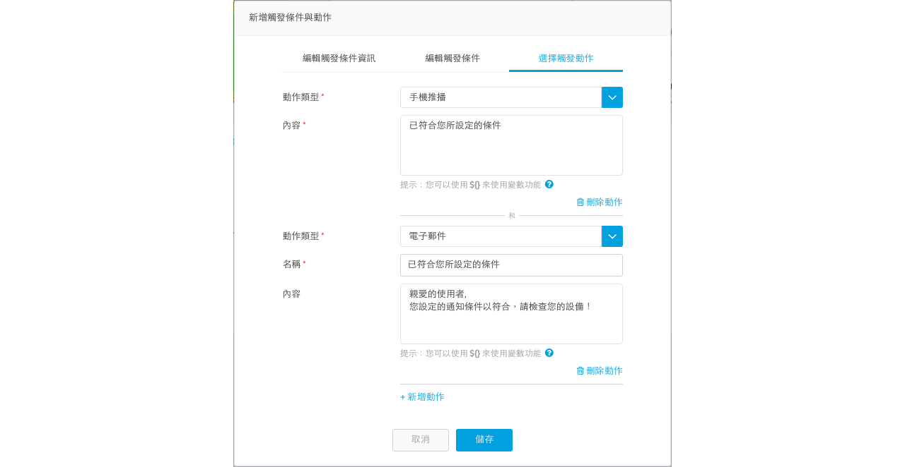
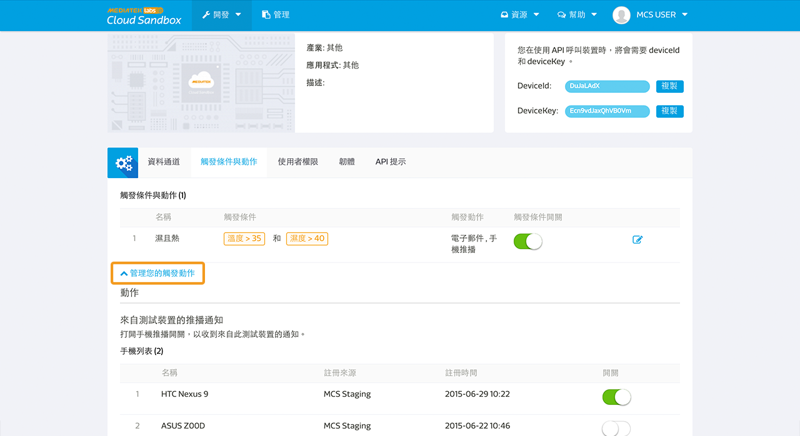

# 設定觸發條件和動作

## 如何新增觸發條件和動作

您可以設定觸發條件和動作，當特定資料通道回傳的值超過您所設定的範圍時，系統將會發出電子郵件或是手機推播通知。您可以自行選擇要收到電子郵件或是手機推播通知。此外，MCS 也支援 webhook 觸發，您可以輸入欲收到處發通知之 url。

請注意，目前 MCS 的通知只限定使用整數或是浮點數類型的資料型態。 並且，只有透過裝置上傳的資料點（上傳資料點時帶有 deviceKey）會觸發動作。使用者透過 MCS 網頁上傳之資料點（不帶有 deviceKey）將不會觸發。

當您點入產品原型頁面後，點選**觸發條件和動作分頁**。

點擊**新增觸發條件和動作**來新增一個觸發條件和動作, 輸入您的觸發條件名稱和描述。

點擊下一步來設定觸發條件。選擇您要設定觸發條件的資料通道並且給予觸發條件值。觸發條件包含大於，小於，等於，和特定範圍之間。

您可以在同一個通知條件中，設定多個資料通道。此時，多個資料通道條件都要符合(且邏輯)，系統才會發出通知。若您想要單一條件符合(或邏輯)就收到通知，您就須設定多個通知條件。

點擊下一步來設定觸發動作。您可以選擇使用電子郵件或是手機推播通知。通知將會被發送給每個有此裝置權限的使用者。

您在產品原型中設定的觸發條件和動作，會被產品原型下所有的測試裝置所繼承。在測試裝置中，您只能更改觸發條件的值或是選擇打開或是關閉此觸發條件和動作。

## 替不同手機設定觸發條件和動作

若使用者有多個手機裝置，MCS 能夠提供使用者設定是否每隻手機裝置都要收到手機推播通知。使用者能於兩個地方設定：

1. 在**個人檔案**頁面中，設定是否手機要收到全部來自 MCS 的推播通知。
2. 在**測試裝置**頁面中，設定是否手機要收到來自特定測試裝置的推播通知。

在**個人檔案**頁面中，您可以看到所有您有安裝 MCS 手機應用程式的手機列表。您可在此設定是否特定手機要收到或不收到**全部**來自 MCS 的推播通知。

在**測試裝置**頁面中，展開**管理您的觸發動作**，您可以看到所有您有安裝 MCS 手機應用程式的手機列表。您可在此設定是否特定手機要收到或不收到特定測試裝置的推播通知。

# 設定一個 webhook 觸發動作

若要設定一個 webhook 觸發動作，您首先需要在產品原型頁面中的觸發條件與動作分頁中，新增一個 webhook 之觸發條件與動作。並且輸入您欲收到此觸發通知之網址。

當您選擇 webhook 觸發動作後，您可以使用測試按鈕，來測試是否通知有被送出。送出之資訊包含 裝置名稱, deviceId, deviceKey, 和觸發值。
