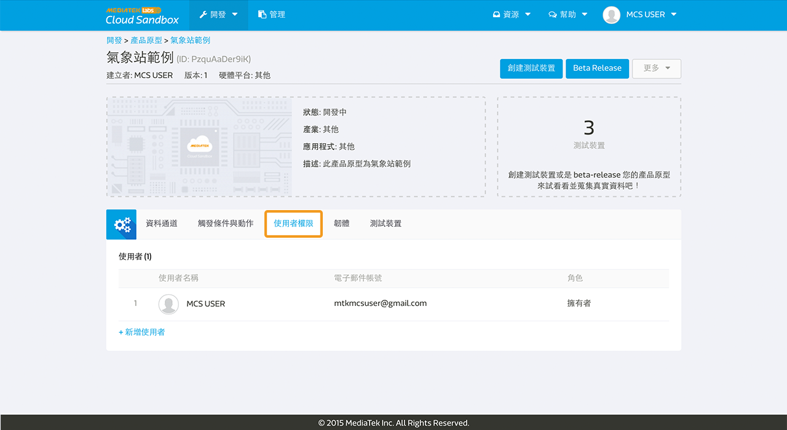

# 設定使用者權限

在 MediaTek Cloud Sandbox (MCS) 平台上，您可以為您的產品原型或是裝置設定不同的使用者權限。您可以在產品原型或是裝置詳細資料頁面中的**使用者權限分頁**中做權限設定。

MCS　提供了三種使用者權限：

1.　**擁有者權限**, 擁有新增，更新，檢視，刪除特定產品原型，測試裝置，以及裝置的權限。

2.　**管理員權限**, 擁有新增，更新，檢視特定產品原型或是測試裝置的權限。

3.　**觀看者權限**, 只擁有檢視特定產品原型或是測試裝置的權限。

## 產品原型與測試裝置

如果您的身分權限是擁有者或是管理員，您可以為特定產品原型或是測試裝置增加或是刪除使用者權限。

在產品原型詳細資料或裝置詳細資料頁面中，點選使用者權限分頁，點擊新增使用者。

輸入使用者電子郵件地址來搜尋 MCS 使用者，並選擇管理員或是瀏覽者權限。之後點擊儲存按鈕。

請注意，測試裝置並不會從他所屬的產品原型中繼承使用者權限。只有在產品原型的擁有者或是管理員有權限建立測試裝置，並且建立此測試裝置的使用者，將成為此測試裝置的擁有者。此測試裝置的擁有者，能替此測試裝置新增其他使用者權限。

## Beta-release 與管理

MCS 鎖定只有**產品原型擁有者**權限者，可以 beta-release 該產品原型。Beta-release 之後，也將只有產品原型的擁有者，可以建立帶有序號的裝置，並且於管理頁面查看並管理這些裝置。

產品原型管理員和觀看者，並無權限可以 beta-release 該產品原型；也無權限可以建立帶有序號之裝置。但是產品原型管理員，依然保有在該產品原型建立測試裝置之權限。
